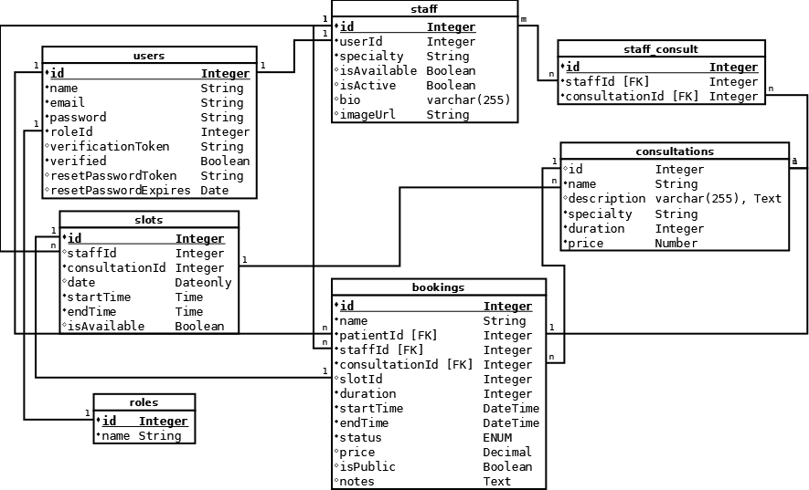

# Időpontfoglaló Rendszer - Teljes Fejlesztői Dokumentáció


## 1. Célkitűzés

Az ElitPort egy komplex egészségügyi menedzsment megoldás az Elit Klinika számára. A rendszer elsődleges célja a manuális adminisztráció – például a telefonos egyeztetés és a papíralapú naptárkezelés – teljes kiváltása egy modern, idősáv-alapú (slot-based) online foglalási rendszerrel.

A projekt fő irányvonala egy olyan intelligens és hiánypótló digitális páciensmenedzsment-platform létrehozása, amely platformfüggetlen (mobilra és asztali környezetre optimalizált), valamint felhasználóbarát, gyors és megbízható élményt biztosít mind a páciensek, mind a klinika szakmai személyzete számára.


## 2. Főfunkciók és szolgáltatások

Az ElitPort rendszer funkciói három fő területre oszthatók: hitelesítés, páciensoldali funkciók és adminisztrációs felület.

### 2.1. Regisztráció és Azonosítás
A rendszer biztonságos hozzáférést biztosít a felhasználók számára:
* **Többszintű autentikáció:** Bejelentkezés e-mail és titkosított jelszó párosával.
* **Szerepkör-alapú hozzáférés-kezelés (RBAC):** A frontend dinamikusan vált a Páciens és az Adminisztrátor felületek között a JWT tokenben tárolt jogosultságok alapján.
* **Fiókkezelés:** Regisztráció, automatikus profil-létrehozás és elfelejtett jelszó (Password Reset) funkció.

### 2.2. Páciens felület (User interface)
A páciensek számára kialakított intuitív felület fő elemei:
* **Interaktív orvosválasztó:** Az elérhető szakemberek esztétikus, kártyás elrendezésű megjelenítése (Doctor Cards).
* **Idősáv-alapú foglalási rendszer:** Szolgáltatás és orvos kiválasztása után a szabad slotok böngészése és lefoglalása.
* **Saját foglalások kezelése:** A páciens áttekintheti korábbi és jövőbeli időpontjait, szükség esetén módosíthatja vagy lemondhatja azokat.

### 2.3. Adminisztrációs felület (Staff & Clinic Management)
A klinika személyzete számára kialakított menedzsment központ:
* **Dashboard:** Statisztikai áttekintés a napi foglalásokról és a klinika telítettségéről.
* **User & Staff Management:** A felhasználók és az egészségügyi személyzet adatainak szerkesztése, jogosultságok kezelése.
* **Consultations (Konzultációk kezelése):** Az összes beérkezett foglalás központi naptárnézete és adminisztratív jóváhagyása.

### 2.4. Automatikus értesítési rendszer
A **Nodemailer** és **Mailtrap** integráció segítségével a rendszer folyamatos visszacsatolást küld:
* Visszaigazolás sikeres regisztrációról.
* Automatikus e-mail értesítés minden új foglalásról, módosításról vagy törlésről.
* Rendszerüzenetek (pl. jelszó-visszaállítási link).


## 3. Felhasznált technológiák

### 3.1 Backend (api - Szerveroldal)

A szerveroldali logika **Node.js** környezetben, **Express.js** keretrendszerrel készült, amely hatékonyan szolgálja ki a REST API végpontokat. Az adatkezelésért a **Sequelize ORM** felel **SQLite3** adatbázissal, a biztonságot pedig **JWT** alapú hitelesítés és **Bcrypt** jelszótitkosítás garantálja.

* **Runtime:** Node.js & Express.js
* **Framework:** Express.js (REST API architektúra)
* **ORM:** Sequelize (SQL absztrakciós réteg az adatbázis hordozhatóságáért)
* **Adatbázis:** SQLite3 (Beágyazott, fájlalapú relációs adatbázis)
* **Biztonság:** JWT (JSON Web Token) & Bcrypt jelszótitkosítás
* **Email:** Nodemailer (Mailtrap integrációval)

### 3.2 Frontend (web - Kliensoldal)

Az ügyféloldali felület **Angular 20** keretrendszerre épül, kihasználva a **Standalone Components** és az **Angular Signals** nyújtotta modern, reaktív állapotkezelést. A szerverrel való kommunikációt **RxJS** alapú **HttpClient** végzi, míg a többnyelvűséget az **@ngx-translate**, a PDF jelentések generálását pedig a **jsPDF** biztosítja.

* **Framework:** Angular 20.3.16 (Standalone Components)
* **Állapotkezelés:** Angular Signals (Reaktív UI állapothoz)
* **Kommunikáció:** HttpClient + RxJS (Functional Interceptors)
* **Stílus:** Bootstrap 5 és Bootstrap Icons (Reszponzív kialakítás)
* **Riportálás:** jsPDF & jsPDF-AutoTable (PDF generálás)
* **Többnyelvűség:** @ngx-translate (HU/EN)

### 3.3. A fejlesztéshez használt szoftverkörnyezet

A projekt megvalósítása során az alábbi alkalmazások és eszközök támogatták a hatékony fejlesztési munkafolyamatot:

* **Visual Studio Code (v1.63.0):** Az elsődleges forráskódszerkesztő, amelyet a beépített terminál, az Angular Language Service és az ESLint bővítmények tettek teljessé a típusbiztos fejlesztés érdekében.
* **Angular CLI (v20.3.16):** A keretrendszer parancssori felülete, amely a projekt struktúrájának kialakításáért, a komponensek generálásáért és a build folyamatok optimalizálásáért felelt.
* **Insomnia (v2021.5.3):** REST API kliens, amellyel a backend végpontok tesztelése, a JSON adatstruktúrák validálása és a JWT alapú hitelesítési folyamatok ellenőrzése történt.
* **Node.js & npm:** A JavaScript futtatókörnyezet és a csomagkezelő, amely a projekt függőségeinek (Angular, Express, Sequelize stb.) verziókövetéséért és a fejlesztői szerver futtatásáért felelt.
* **DB Browser for SQLite:** (Opcionális, ha használtad) Az adatbázis tartalmának vizuális ellenőrzésére és a táblák szerkezetének manuális validálására használt eszköz.
* **Mailtrap:** Virtuális SMTP szerver az e-mail küldési logika teszteléséhez.
* **Git:** Verziókezelő rendszer a kódváltozások követésére és a biztonságos mentések kezelésére.

---

## 4. Általános működés
Az ElitPort egy állapotmentes (stateless) REST API-ra épül. A kommunikáció minden esetben JSON formátumban történik. 

**A rendszer logikai folyamata:**
1. A páciens böngészheti a szakembereket és szolgáltatásokat (publikus).
2. Foglaláshoz a páciensnek regisztrálnia kell, majd bejelentkeznie.
3. Bejelentkezéskor a szerver egy JWT tokent küld, amelyet a kliens minden további védett kérés fejlécében (`Authorization: Bearer`) visszaküld.
4. Az Adminisztrátorok és a Személyzet (Staff) speciális jogosultságokkal rendelkeznek az időpontok generálásához és a felhasználók kezeléséhez.

---

## 5. Kódolási konvenciók és Projektstruktúra

A projekt követi a tiszta kód (Clean Code) és az MVC (Model-View-Controller) alapelveit, angol nyelvű belső logikával és magyar/angol nyelvű felhasználói felülettel.


### 5.1 Könyvtárszerkezet

### 5.1.1 Részletes projektstruktúra (Backend)

Az alkalmazás moduláris felépítésű, ahol az `app/` mappa tartalmazza a forráskódot, a gyökérkönyvtár pedig a konfigurációs és adatbázis fájlokat.

```text
api/
├── app/
│   ├── controllers/         
│   │   ├── authController.js        # Regisztráció és bejelentkezés
│   │   ├── userController.js        # Felhasználói adatok kezelése
│   │   ├── staffController.js       # Orvosi személyzet menedzselése
│   │   ├── consultationController.js # Konzultációk/Szakrendelések
│   │   └── bookingController.js     # Foglalások logikája
│   ├── database/            
│   │   └── db.js                    # Sequelize kapcsolat inicializálása
│   ├── middleware/          
│   │   ├── auth.js / authjwt.js     # Hitelesítés és JWT validálás
│   │   ├── checkRole.js             # Jogosultság ellenőrzés
│   │   └── upload.js                # Fájlfeltöltés kezelése
│   ├── models/              
│   │   ├── role.js, user.js, staff.js, slot.js, 
│   │   ├── consultation.js, booking.js
│   │   └── models.js                # Modell asszociációk (Kapcsolatok)
│   ├── routes/              
│   │   └── api.js                   # API végpontok (Routing)
│   ├── services/            
│   │   ├── bookingService.js        # Foglalási üzleti logika
│   │   └── emailService.js          # Nodemailer / Mailtrap integráció
│   └── utils/               
│       ├── path.js, logger.js       # Segédfüggvények
├── database/                
│   ├── migrations/                  # Adatbázis sémák verziói
│   └── seeders/                     # Tesztadatok (feltöltő scriptek)
├── docs/                            # Részletes dev/user dokumentáció
├── test/                            # Mocha/Chai tesztfájlok (.spec.js)
├── .env                             # Környezeti változók
├── database.sqlite                  # A projekt SQLite adatbázis fájlja (Gyökérben)
├── package.json                     # Projekt leíró és függőségek
└── README.md                        # Általános tájékoztató

```
### 5.2 Konvenciók
* **Nyelv:** A forráskód (változók, metódusok, adatbázis mezők) angol nyelvű.
* **Elnevezés:** camelCase a változóknál, PascalCase az osztályoknál/modelleknél.
* **Verziókezelés:** Git használata, értelmezhető commit üzenetekkel.

### 5.3. Az alkalmazás általános működési elve

Az ElitPort backend egysége egy szabványos **REST API**, amely HTTP kéréseken keresztül kommunikál az Angular frontenddel. Az adatok cseréje minden esetben **JSON** formátumban történik, biztosítva a platformfüggetlen adatátvitelt.

#### Hozzáférés és biztonság
A végpontok védelmét a rendszer két fő csoportra osztja a biztonsági követelményeknek megfelelően:
* **Publikus végpontok:** Ezek használatához nem szükséges előzetes hitelesítés. Ide tartozik a felhasználói regisztráció, a bejelentkezés, az elérhető szakemberek (`staff`) listázása, valamint a szabad idősávok (`slots`) és a kínált szolgáltatások (`consultations`) lekérdezése.
* **Védett végpontok:** Csak érvényes **JWT (JSON Web Token)** birtokában érhetőek el. A rendszer a token alapján azonosítja a felhasználót és ellenőrzi a jogosultságát (RBAC). Védett műveletnek minősül az időpontfoglalás, a foglalások módosítása/törlése, az orvosi profilok karbantartása, valamint a teljes adminisztrációs Dashboard elérése.

#### Logikai felépítés (MVC és Service réteg)
A vezérlést **kontrollerek** valósítják meg, amelyek a feladatkörök szerinti bontásban kezelik az üzleti folyamatokat:
* Az adatokat JSON formátumban fogadja és dolgozza fel a rendszer. Minden adatkezelési csoportnak (autentikáció, felhasználók, személyzet, konzultációk, foglalások) külön kontrollere van, ahol az adatok validálása és a kérések irányítása történik.
* A kontrollerek **modellekkel** állnak kapcsolatban, amelyek az adatkezelésért felelősek. Minden entitáshoz (User, Staff, Slot, Consultation, Booking) külön modell tartozik, amelyek az adatok adatbázisból való kiolvasásáért, illetve az oda történő írásért felelnek.
* A modellek közvetlenül az adatbázis táblákkal vannak kapcsolatban, biztosítva az adatok perzisztens tárolását a `database.sqlite` fájlban.

Ez a rétegelt architektúra garantálja, hogy a felhasználói felület, az üzleti logika és az adattárolás élesen elváljon egymástól, ami elengedhetetlen a hosszú távú karbantarthatóság és a biztonságos működés érdekében.

### 5.4. Osztályok és Metódusok (Backend)

A projekt a Sequelize ORM rendszert használja, így minden adatbázis-táblához tartozik egy megfelelő modell-osztály a backend oldalon. Ezek az osztályok felelnek az adatok validálásáért és a relációk kezeléséért.


#### User osztály
A rendszer központi osztálya, amely a hitelesítéshez szükséges adatokat tárolja.
* **Felelőssége:** Felhasználók azonosítása, jelszavak biztonságos kezelése, jogosultsági kör (Role) társítása.
* **Kulcsfontosságú mezők:** `email`, `password`, `roleId`, `isVerified`.

#### Staff osztály
A `User` osztály kiterjesztése az egészségügyi dolgozók számára.
* **Felelőssége:** Az orvosok szakmai adatainak, bemutatkozásának és elérhetőségének tárolása.
* **Kapcsolat:** 1:1 relációban áll a User osztállyal.


#### Consultation osztály
A klinika által nyújtott szolgáltatások gyűjtőosztálya.
* **Felelőssége:** A vizsgálatok típusainak, alapértelmezett időtartamának és árainak definiálása.
* **Kapcsolat:** N:M relációban áll a Staff osztállyal (egy orvos több szolgáltatást is nyújthat).

#### Slot osztály
A naptárkezelés alapegysége.
* **Felelőssége:** Konkrét időintervallumok (idősávok) reprezentálása. Tárolja, hogy az adott időpont szabad-e (`isAvailable`), és melyik orvoshoz tartozik.
* **Kulcsfontosságú mezők:** `startTime`, `endTime`, `date`, `staffId`.

#### Booking osztály
A foglalási tranzakciókat reprezentáló osztály.
* **Felelőssége:** Összekapcsolja a pácienst, az orvost, a szolgáltatást és a lefoglalt idősávot. Itt dől el a foglalás aktuális állapota (függőben, elfogadva, törölve).
* **Kulcsfontosságú mezők:** `status`, `price`, `patientId`, `slotId`.
  
#### Role osztály
A jogosultsági szinteket meghatározó segédosztály.
* **Felelőssége:** Definiálja a felhasználói típusokat (User: 0, Staff: 1, Admin: 2), lehetővé téve a szerepkör-alapú hozzáférés-szabályozást.

### BaseController
Központi osztály az egységes API válaszok kezelésére.
* `sendResponse(data, message)`: Sikeres kérések JSON formázása.
* `sendError(error, code)`: Hibaüzenetek és HTTP státuszkódok kezelése.

### AuthController
A hitelesítési folyamatokat vezérli.
* `register(req, res)`: Felhasználó rögzítése, jelszó hashelése.
* `login(req, res)`: Hitelesítés, token generálás.
* `forgotPassword(req, res)`: Visszaállító token generálása és e-mail küldése.

### StaffController
A klinikai személyzet menedzselése.
* `index()`: Szakemberek listázása (szűrhető).
* `store()`: Új orvos rögzítése (Admin jogosultsággal).
* `update()`: Adatok módosítása.
* `destroy()`: Orvos eltávolítása a rendszerből.

### BookingController
A foglalási logika motorja.
* `store()`: Foglalás rögzítése, slot zárolása (atomikus művelet).
* `destroy()`: Lemondás kezelése a 24 órás szabály ellenőrzésével.

### AdminService (Frontend)
Feladata az összetett statisztikai lekérdezések és a PDF generálás támogatása.
* `getGlobalStats()`: Aggregált adatokat kér le az összes foglalásról.
* `generateReport()`: Meghívja a jsPDF logikát és elindítja a fájl letöltését.
  
### StatsController (Backend)
Speciális végpont az adminisztrátori adatokhoz.
* `getDashboardData()`: SQL `COUNT` és `SUM` függvényekkel összesíti a bevételeket és a foglaltságot, majd optimalizált JSON-t ad vissza.
---

## 6. Adatmodell és Architektúra

A rendszer architektúrája az \*\*MVC (Model-View-Controller)\*\* mintát követi.

A rendszer logikai felépítését és az entitások közötti kapcsolatokat az alábbi dokumentum tartalmazza:

## 6.1 API UML
A rendszer architektúrája az **MVC (Model-View-Controller)** mintát követi, elválasztva az adatokat a logikától és a megjelenítéstől.

[Image of Model-View-Controller architecture diagram]


Az adatbázis sémáját és a táblák közötti kapcsolatokat az alábbi diagram szemlélteti:



*Megjegyzés: A diagram forrásfájlja az [datamodel.dia](./datamodel.dia) állományban érhető el.*
[Image of Model-View-Controller architecture diagram]


Az adatbázis sémáját és a táblák közötti kapcsolatokat az alábbi diagram szemlélteti:


*Megjegyzés: A diagram forrásfájlja az [datamodel.dia](./datamodel.dia) állományban érhető el.*
---

### 6.1.1 Adatbázis sémák (Táblák tervezete)

A rendszer az alábbi központi táblák segítségével kezeli az Elit Klinika adatait:

* **users:** A rendszer minden felhasználóját tárolja (páciensek és adminisztrátorok).
  * `id, name, email, password, roleId, verificationToken, verified, resetPasswordToken`
* * **roles:** A felhasználói jogosultsági szinteket definiálja.
  * `id, name` (2: 'admin', 0: 'user', 1: 'staff')
* **staff:** Az egészségügyi szakemberek adatai.
  * `id, userId, specialty, bio, isActive, isAvailable, image` (szakterület)
* **consultations:** A klinika által kínált kezelések és szolgáltatások.
  * `id, name, description, specialty, duration, price`
* **slots:** A naptárban lefoglalható idősávokat tárolja.
*  `id, staffId, consultationId, date, startTime, endTime, isAvailable`
*  **Szerepe:** A rendszer előre generált vagy dinamikus idősávokat használ. A `isAvailable` (boolean) mező jelzi, hogy az adott sáv szabad-e még a páciensek számára.
* **staff_consult:** Kapcsolótábla (Many-to-Many), amely meghatározza, hogy melyik orvos milyen szolgáltatásokat nyújt.
  * `id, staffId, consultationId`
* **bookings:** A központi foglalási tábla, amely összefogja a folyamat szereplőit.
  * `id, name, patientId, staffId, consultationId, slotId, duration, startTime, endTime status, price, isPublic` (pl. függőben, visszaigazolva, lemondva)

### 6.2. Relációk és adatintegritás

A projekt az adatintegritás érdekében az alábbi Sequelize asszociációkat alkalmazza, amelyek meghatározzák az API válaszok struktúráját is:

1. **Felhasználó és Szerepkör (1:N):**
   * Minden felhasználóhoz pontosan egy szerepkör tartozik (`roleId`), míg egy szerepkörhöz (pl. 'páciens') több felhasználó is rendelhető.

2. **User - Staff (1:1):**
   * Speciális kapcsolat, ahol a `Staff` tábla kiterjeszti a `User` táblát. Csak az egészségügyi személyzet rendelkezik `staffProfile` bejegyzéssel.

3. **Személyzet és Idősávok (1:N):**
   * Az orvosokhoz (`Staff`) több lehetséges időpont (`Slot`) tartozik. A lekérdezéseknél ez lehetővé teszi a naptár alapú bontást szakemberek szerint.

4. **Konzultációk és Személyzet (M:N):**
   * A `staff_consult` kapcsolótáblán keresztül megvalósított több-a-többhöz kapcsolat. Ez biztosítja a rugalmasságot: egy orvos több kezelést is végezhet, és egy adott vizsgálat-típust több orvos is nyújthat.

5. **A Foglalás (Booking) központi kapcsolatai:**
   * **Páciens (1:N):** A felhasználó `appointments` néven éri el saját foglalásait.
   * **Orvos és Kezelés (1:N):** A foglalás rögzíti, ki végzi a beavatkozást és pontosan melyik konzultáció valósul meg.
   * **Slot (1:1):** Minden foglalás pontosan egy konkrét idősávhoz (`timeSlot`) kötődik.

6. **Konzultáció és Slot (1:N):**
   * Az idősávok definíciója tartalmazza, hogy az adott időintervallumban melyik szakrendelés/kezelés (`treatment`) érhető el.
  
7. **Hitelesítési integritás:** 
   * Minden funkció elérése érvényes munkamenethez (JWT tokenhez) kötött. A `verified` mező biztosítja, hogy csak visszaigazolt e-mail címmel lehessen aktív foglalást kezdeményezni.
   

### 6.3. Biztonsági architektúra
A jelszavak tárolása nem nyers szövegként, hanem **Bcrypt** algoritmussal hashelve történik. Az adatbázis szintű validációk (pl. egyedi e-mail cím, nem üres mezők) garantálják, hogy a rendszerbe csak valid adatok kerülhessenek.

## 7. Részletes API Végpontok (EndPoints)
Az API minden végpontja az alap URL (pl. `/api`) után értendő. A végpontok többsége [verifyToken] middleware-rel védett, bizonyos műveletek pedig [checkRole] korlátozás alá esnek (1: Staff, 2: Admin).

### 7.1 🔐 Hitelesítés (Auth)

A regisztrációs és jelszókezelési folyamatokért felelős publikus végpontok.

| Metódus | Végpont | Leírás | Védettség |
|:---|:---|:---|:---|
| POST | `/register` | Új felhasználó regisztrációja | Publikus |
| POST | `/login` | Bejelentkezés és JWT token generálása | Publikus |
| GET | `/verify-email/:token` | E-mail cím megerősítése | Publikus |
| POST | `/forgot-password` | Elfelejtett jelszó (reset link küldése) | Publikus |
| POST | `/reset-password` | Új jelszó beállítása a kapott tokennel | Publikus |


### 7.2 Felhasználók és Profilok (Users)

A felhasználók saját adatai, valamint az adminisztrátori felhasználókezelés.

| Metódus | Végpont | Leírás | Védettség |
|:---|:---|:---|:---|
| GET | `/profile/me` | Saját profiladatok lekérése | [Token] |
| PUT | `/profile/update` | Saját adatok módosítása | [Token] |
| GET | `/users` | Összes felhasználó listázása | [Admin] |
| GET | `/users/:id` | Egy konkrét felhasználó adatai | [Token] |
| POST | `/users/:id/password` | Jelszómódosítás admin által | [Admin] |
| POST | `/users/:id/status` | Felhasználói státusz (aktív/inaktív) állítása | [Admin] |
| PUT | `/users/:id` | Felhasználó adatainak módosítása | [Admin] |
| DELETE | `/users/:id` | Felhasználó végleges törlése | [Admin] |

### 7.3. 👨‍⚕️ Egészségügyi Személyzet (Staff)
Az orvosok és szakemberek kezelése, valamint szolgáltatásaik társítása.

| Metódus | Végpont | Leírás | Védettség |
|:---|:---|:---|:---|
| GET | `/staff` | Összes szakember listázása | Publikus |
| GET | `/staff/public` | Publikusan látható orvosi profilok | Publikus |
| GET | `/staff/:id/treatments` | Az orvoshoz rendelt szolgáltatások | Publikus |
| POST | `/staff/:id/treatments`| Szolgáltatások rendelése az orvoshoz | [Admin] |
| POST | `/staff` | Új személyzeti tag manuális rögzítése | [Admin] |
| POST | `/staff/promote` | Meglévő felhasználó előléptetése orvossá | [Admin] |
| DELETE | `/staff/:id` | Szakember törlése | [Admin] |

### 7.4. 📅 Konzultációk, Idősávok és Foglalások
A klinika operatív működését biztosító végpontok.

#### Konzultációk (Services)
* **GET** `/consultations`: Elérhető vizsgálatok listája (Publikus)
* **POST/PUT/DELETE** `/consultations`: Szolgáltatások menedzselése ([Admin])

#### Idősávok (Slots)
* **GET** `/slots`: Összes idősáv lekérése.
* **POST** `/slots/generate`: Idősávok tömeges generálása egy adott időszakra ([Token]).
* **POST** `/slots`: Egyedi idősáv létrehozása ([Staff/Admin]).

#### Foglalások (Bookings)
* **GET** `/bookings`: A felhasználó saját foglalásai, vagy admin esetén az összes.
* **POST** `/bookings`: Új időpont lefoglalása ([Token]).
* **PUT/DELETE** `/bookings/:id`: Foglalás módosítása vagy lemondása ([Token]).

| Végpont | Metódus | Jogosultság | Leírás |
| :--- | :--- | :--- | :--- |
| `/slots` | GET | Publikus | Elérhető (isAvailable: true) időpontok listázása. |
| `/slots/generate` | POST | Admin/Staff | Idősávok tömeges generálása egy adott intervallumra. |
| `/bookings` | GET | Token | A bejelentkezett felhasználó saját foglalásai. |
| `/bookings` | POST | Token | Foglalás rögzítése és slot zárolása. |
| `/bookings/:id` | DELETE | Token | Lemondás (csak a kezdés előtt 24 órával). |

## 8. Fejlesztői környezet (Setup Guide)

Ez a fejezet tartalmazza a projekt futtatásához és fejlesztéséhez szükséges lépéseket.

### 8.1. Előfeltételek (Prerequisites)
A rendszer futtatásához az alábbi szoftverek telepítése szükséges:
* **Node.js:** v16.x vagy újabb (ajánlott az LTS verzió).
* **npm:** A Node.js-szel együtt települő csomagkezelő.
* **Angular CLI:** `npm install -g @angular/cli@20` (a frontend fordításához).
* **Git:** A forráskód kezeléséhez.

### 8.2. Telepítési lépések

A projekt két fő részre tagolódik, mindkét mappában el kell végezni a függőségek telepítését:

1. **Repository klónozása:**
   ```bash
   git clone [repository_url]
    ```
2. **Backend (API) függőségek telepítése:**
   ```bash
   cd api
   npm install
    ```
3. **Frontend (Web) függőségek telepítése:**
   ```bash
   cd ../web
   npm install
    ```
### 8.3. Környezeti változók (.env)

A backend működéséhez elengedhetetlen egy `.env` fájl manuális létrehozása az `api/` könyvtár gyökerében. Ez a fájl tárolja a biztonsági kulcsokat és az adatbázis konfigurációját:

```env
PORT=3000
DB_STORAGE=./database.sqlite
JWT_SECRET=titkos_szoveg
APP_KEY=generalt_api_kulcs_a_csomaggal

# Email beállítások (pl. Mailtrap teszteléshez)
MAIL_HOST=smtp.mailtrap.io
MAIL_PORT=2525
MAIL_USER=felhasznalonev
MAIL_PASS=jelszo
```
### 8.4. Adatbázis inicializálása

Mivel a projekt SQLite-ot használ, az adatbázis fizikai fájljának létrehozásához és a tesztadatok betöltéséhez az egyedi `op.js` szkriptet kell alkalmazni:

#### Táblák létrehozása (Migrations)

```bash
node op migrate
```
#### Tesztadatok feltöltése (Seeding)

```bash
node op db:seed
```
### 8.5. Az alkalmazás futtatása

A fejlesztés során a hatékony munkavégzés érdekében javasolt két külön terminálablak használata:

* **Backend indítása:** Az `api/` mappában futtatva a `npm run dev` parancs elindítja a szervert. A `nodemon` figyelni fogja a fájlváltozásokat, és szükség esetén automatikusan újraindítja a szolgáltatást.
* **Frontend indítása:** A `web/` mappában az `ng serve` vagy `npm start` parancs fordítja és futtatja az Angular alkalmazást.
  * **Alapértelmezett kliens elérés:** `http://localhost:4200`
  * **API bázis URL:** `http://localhost:8000/api`

### 8.6. Ajánlott VS Code bővítmények

A kódminőség és a fejlesztési sebesség növelése érdekében javasolt az alábbi kiterjesztések telepítése:

* **Angular Language Service:** Az Angular sablonok (HTML) intelligens kódkiegészítéséhez és hibakereséséhez.
* **SQLite Viewer:** Lehetővé teszi a `database.sqlite` bináris fájl tartalmának megtekintését és szerkesztését közvetlenül a szerkesztőben.
* **ESLint:** Segít betartani a projektben meghatározott kódolási konvenciókat és kiszűrni a potenciális hibákat.
* **Prettier - Code formatter:** A forráskód egységes és tiszta formázásáért felel.
* **REST Client:** Lehetőséget ad az API végpontok tesztelésére közvetlenül a VS Code-ból, `.http` fájlok használatával.

## 9. Algoritmusok és Üzleti Logika 

### 9.1 Kiemelt technikai megoldások

A rendszer stabilitását és nemzetközi megfelelőségét az alábbi három pillér biztosítja:

#### 1. Foglalási Validáció (Concurrency Control)
A foglalás rögzítése előtt a backend többszintű ellenőrzést végez a `BookingController` segítségével:
* **Állapotvizsgálat:** Mielőtt a rendszer létrehozná a foglalási rekordot, lekérdezi az adott `Slot` (idősáv) státuszát. 
* **Ütközéskezelés:** Amennyiben a slot `isAvailable` értéke már hamis (false), a folyamat megszakad és a backend `400 Bad Request` hibaüzenetet küld. Ez garantálja, hogy még párhuzamos kérések esetén is elkerülhető legyen a kettős foglalás (double booking).

#### 2. Szabványos Dátumkezelés
Az időzónákból adódó pontatlanságok és a szerver-kliens közötti eltérések elkerülése érdekében:
* **Formátum:** A rendszer szigorúan az **ISO 8601** szabványt (`YYYY-MM-DD` és `HH:mm`) követi minden adatátvitel során.
* **Feldolgozás:** A dátumok az adatbázisban és a backend logikában is string-alapú összehasonlítással vagy `Date` objektummá alakítva kerülnek feldolgozásra, így biztosítva a konzisztenciát a naptár nézetben.

#### 3. Lokalizált Hibaüzenetek (i18n stratégia)
A backend nem tartalmaz hard-coded (beégetett) magyar vagy angol szövegeket, ami megkönnyíti a későbbi többnyelvűsítést:
* **Hiba-kulcsok:** Hiba esetén az API csak egy egyedi azonosító kulcsot ad vissza (például: `MESSAGES.AUTH.PASSWORD_MISMATCH`).
* **Frontend fordítás:** Az Angular frontend az `assets/i18n/*.json` fájlok alapján, a kapott kulcs behelyettesítésével jeleníti meg a felhasználónak a tényleges üzenetet a választott nyelven. Ezáltal a backend és frontend felelőssége élesen elválik egymástól (Separation of Concerns).

### 9.2 További algoritmusok - technikai megoldások

1. **Biztonságos Foglalás:** A rendszer a foglalás pillanatában ellenőrzi az idősáv (`Slot`) foglaltságát. Ha két kérés egyszerre érkezik ugyanarra az időpontra, az adatbázis integritása garantálja, hogy csak az egyik sikeres (atomikus update).
2. **24 Órás Szabály:** A lemondási logika kiszámítja a foglalás időpontja és az aktuális szerveridő közötti különbséget. Ha ez kevesebb, mint 86 400 másodperc, a törlés hibaüzenettel leáll.
3. **Automatikus Idősáv Generálás:** Egy algoritmus segítségével a személyzet megadhatja a napi munkaidő kezdetét és végét, valamint a vizsgálat hosszát, a rendszer pedig automatikusan létrehozza a szabad `Slot` rekordokat.
4. * **Dinamikus Sablonkezelés:** Az `EmailService` modulban futó algoritmus, amely a foglalási adatokat (orvos, dátum, ár) injektálja a HTML sablonba küldés előtt.

### 9.3. Adatanalitika és Riportálás (Dashboard Logic)

Az adminisztrációs felület tartalmaz egy komplex elemző modult, amely a nyers adatbázis-rekordokból üzleti mutatókat (KPI) generál és tesz exportálhatóvá.

#### 9.3.1. KPI Számítási algoritmusok
A `AdminDashboardComponent` a `forkJoin` operátor segítségével párhuzamosan kéri le az összes szükséges entitást, majd az alábbi számításokat végzi el kliensoldalon:
* **Pénzügyi mutatók:** A rendszer szűri a lemondott (`cancelled`) foglalásokat, és csak a valósított időpontok alapján számol bruttó bevételt.
* **Személyzeti hatékonyság:** Az algoritmus összeveti az orvosok összesített foglalásait egy elvárt heti kapacitással (40 óra), így százalékos kihasználtsági mutatót generál.
* **Időbeli leterheltség (Heatmap):** Egy mátrix-alapú algoritmus végigfut a foglalások dátumán és kezdőidőpontján, majd napokra és órákra lebontva összesíti a klinika forgalmát.

#### 9.3.2. PDF Generálás (jsPDF & AutoTable)
A riportálási funkció lehetővé teszi a vizuális adatok fizikai dokumentummá alakítását:
* **Technológia:** A generálás a `jsPDF` könyvtárral és az `autoTable` pluginnal történik közvetlenül a böngészőben, tehermentesítve a szervert.
* **Dinamikus táblázatok:** A PDF export során a heatmap adatai egy rácsos szerkezetű táblázatba rendeződnek, amely tartalmazza az időpontokat és a napi foglalásszámokat.
* **Nemzetköziesítés (i18n):** A riport fejlécét és táblázatának oszlopneveit a `TranslateService` segítségével az aktuálisan választott nyelven generálja le a rendszer, így a PDF követi a felhasználói felület nyelvét.

#### 9.3.3. Heatmap Vizualizáció
A frontend egy egyedi színskálát használ a leterheltség szemléltetésére:
* `0 foglalás`: Világosszürke (üres)
* `1-2 foglalás`: Világoskék (alacsony forgalom)
* `3-5 foglalás`: Középkék (közepes forgalom)
* `6+ foglalás`: Sötétkék (kritikus/magas forgalom)

## 9.4 Frontend Logika és Állapotkezelés

### Angular Signals

A globális állapotot (pl. bejelentkezett-e a felhasználó, mi a neve és a jogosultsága) \*\*Signals\*\* segítségével tároljuk az `AuthService`-ben. Ez biztosítja az azonnali UI frissítést minden komponensben.

### Biztonság (Interceptor)

Az `AuthInterceptor` minden HTTP kéréshez automatikusan csatolja a `Bearer Token`-t. Amennyiben a szerver 401-es hibát ad (lejárt munkamenet), az interceptor automatikusan kijelentkezteti a felhasználót.


## 10. Tesztelés

A fejlesztési folyamat során többszintű tesztelési stratégiát alkalmaztam a kódminőség biztosítása és a logikai hibák minimalizálása érdekében.

### 10.1. API Végpontok tesztelése (Insomnia)
A backend fejlesztése során az **Insomnia** REST klienst használtam a végpontok manuális verifikálására.
* **Funkcionális tesztek:** Ellenőriztem, hogy a végpontok a specifikációnak megfelelő JSON választ adják-e vissza.
* **Autorizációs tesztek:** Teszteltem, hogy a védett végpontok (pl. `/admin/users`) valóban visszautasítják-e a kérést érvénytelen vagy hiányzó JWT token esetén.
* **Hibakezelés:** Validáltam, hogy rossz adatbevitel esetén (pl. foglalt idősáv vagy érvénytelen email formátum) a rendszer a megfelelő hiba-kulcsokat adja-e vissza.

### 10.2. Unit és Integrációs tesztek (Mocha & Chai)
A backend üzleti logikájának és az adatbázis-műveleteknek az ellenőrzésére a **Mocha** tesztkeretrendszert használtam **Chai** asseveration könyvtárral.
* **Modell tesztek:** A Sequelize modellek validációs szabályainak ellenőrzése (pl. kötelező mezők kitöltése).
* **Controller tesztek:** Az API logikai folyamatainak (pl. foglalás mentése, jelszó hashelés) izolált vizsgálata.

### 10.3. Frontend tesztelés
Az Angular környezetben az alábbi ellenőrzéseket végeztem el:
* **Komponens tesztek:** A kritikus komponensek (pl. foglalási naptár, dashboard heatmap) renderelésének és alapvető működésének vizsgálata.
* **Reaktív adatkötés tesztelése:** Annak igazolása, hogy a **Signals** alapú állapotkezelés hatására a UI azonnal frissül a bejelentkezés vagy adatmódosítás után.
* **Cross-browser tesztelés:** Megjelenés és funkcionalitás ellenőrzése Chrome, Firefox és Edge böngészőkben.

### 10.4. Felhasználói elfogadási teszt (UAT)
A rendszer végponttól végpontig (End-to-End) történő manuális átvizsgálása:
* Egy teljes páciens-út szimulálása: Regisztráció -> Email megerősítés -> Belépés -> Orvos választás -> Időpontfoglalás -> Foglalás megtekintése a profilban.
* Adminisztrátori folyamat szimulálása: Új szolgáltatás felvétele -> Idősávok generálása -> Dashboard statisztikák ellenőrzése -> PDF riport generálása.

### 10.5. Összetett adminisztrációs folyamatok tesztelése

A rendszer kritikus üzleti folyamatait az alábbi forgatókönyvek mentén validáltam:

#### 10.5.1. Szakember felvételi folyamat (User to Staff Workflow)
Ez a folyamat több adatbázis-műveletet és jogosultság-módosítást érint:
* **User előléptetés:** Teszteltem, hogy egy meglévő egyszerű felhasználó (User) hogyan kap `Staff` jogosultságot az admin felületen keresztül.
* **Profil kiegészítés:** A szakemberhez tartozó speciális adatok (szakterület, bemutatkozás, ár) CRUD műveleteinek ellenőrzése.
* **Megjelenés vizsgálat:** Annak igazolása, hogy az új szakember automatikusan megjelenik-e a páciensek számára a szakember-listában (Staff_card), és az adatai helyesen (kép, név, specializáció) renderelődnek-e.

#### 10.5.2. Kapacitásmenedzsment (Slot Generation)
* **Automatizált generálás:** Teszteltem az algoritmust, amely az admin által megadott idősáv-intervallumok alapján (pl. 08:00 - 16:00, 30 perces egységekben) tömegesen hozza létre az elérhető időpontokat az adatbázisban.
* **Ütközésmentesség:** Annak ellenőrzése, hogy a generáló script nem hoz-e létre duplikált idősávokat már létező időpontokra.

#### 10.5.3. Kivételes esetek kezelése (Manual Intervention)
Egy valós kórházi/klinikai környezetben előfordulhatnak egyedi helyzetek, amelyeket manuálisan kell kezelni:
* **24 órán belüli lemondás:** Teszteltem azt a forgatókönyvet, amikor a páciens telefonon jelzi lemondási szándékát az utolsó pillanatban. 
* **Adminisztrátori cancel:** Az adminisztrátor képes felülbírálni a rendszerszabályokat, és manuálisan "Cancelled" állapotba tenni a foglalást, felszabadítva ezzel az idősávot más páciensek számára.
* **Naplózás:** Ellenőriztem, hogy a státuszmódosítás után a foglalás bekerül-e az archivált/lemondott statisztikákba, amit a Dashboard PDF riportja is helyesen mutat-e.

#### 10.5.4. UI/UX komponens tesztek
* **Staff_card megjelenítés:** Külön vizsgáltam, hogy a szakember kártyák reszponzív módon jelennek-e meg (mobilnézetben egymás alatt, asztali nézetben rácsban).
* **Loading states:** Teszteltem, hogy az adatok betöltése közben (pl. a Dashboard-on) megjelennek-e a pörgettyűk (spinners), megelőzve a felhasználói bizonytalanságot.

#### 10.5.5. Egyéb tesztek

* **PDF Validáció:** Manuális ellenőrzés során vizsgáltuk a generált fájlok olvashatóságát különböző PDF olvasókban (Adobe, Chrome, Edge).
* **Dashboard Reaktivitás:** Teszteltük, hogy új foglalás rögzítése után a Dashboard grafikonjai és számlálói azonnal frissülnek-e a Signals segítségével.

### 10.6. Reszponzivitás és eszközfüggetlenség (UI/UX Teszt)

Az alkalmazás felülete dinamikusan alkalmazkodik a különböző kijelzőméretekhez. A tesztelés során három fő kategóriát (breakpoint) határoztam meg, amelyeket a Chrome DevTools szimulátorával és valós eszközökkel is verifikáltam:

#### 10.6.1. Mobil nézet (Smartphone - <768px)
* **Navigáció:** A felső menüsor egy kompakt "hamburger" menübe rendeződik, hogy ne foglaljon felesleges helyet.
* **Staff kártyák:** A szakemberek listája egyetlen függőleges oszlopba rendeződik, a kártyák kitöltik a teljes képernyőszélességet a könnyű görgethetőség és kattinthatóság érdekében.
* **Táblázatok:** Az adminisztrációs táblázatok vízszintesen görgethetővé válnak, vagy kártya-nézetté alakulnak, hogy olvashatóak maradjanak.

#### 10.6.2. Tablet nézet (Tablet - 768px - 1024px)
* **Elrendezés:** A Dashboard elemei (KPI kártyák) 2x2-es rácsba rendeződnek.
* **Naptár funkció:** A foglalási naptár már több napot mutat egyszerre, a gombok mérete az érintőképernyős használathoz optimalizált (Touch-friendly design).
* **Sidebar:** Az admin felületen az oldalsó menü az ikonokra zsugorodik, növelve a tartalom számára rendelkezésre álló hasznos területet.

#### 10.6.3. PC / Desktop nézet (>1024px)
* **Teljes funkcionalitás:** A Dashboard Heatmap és az összes statisztikai grafikon teljes szélességben, egymás mellett jelenik meg.
* **Szakember lista:** A `Staff_card` komponensek 3 vagy 4 oszlopos grid elrendezést vesznek fel (CSS Grid/Flexbox segítségével).
* **Adatbevitel:** Az űrlapok (pl. új szakember felvétele) többoszlopos elrendezésben jelennek meg, csökkentve a függőleges görgetés szükségességét.

**Alkalmazott technológiák:**
* **Bootstrap / Tailwind / Custom CSS Media Queries:** A töréspontok kezelésére.
* **Angular Flex-Layout:** A dinamikus komponens-elrendezéshez.


### Tesztelés összefoglaló
* **Automatizált tesztek:** Mocha és Supertest segítségével minden végpontot tesztelünk (sikeres kérések, hibás tokenek, jogosulatlan hozzáférések).
* **Teszt környezet:** A teszteléshez egy elkülönített `:memory:` SQLite adatbázis használunk, amely minden futtatáskor frissül.
* **Manuális validáció:** Az Insomnia kliensben összeállított tesztcsomag biztosítja a funkcionális működés ellenőrzését.

---

## 11. Ismert hibák és korlátok (Known Issues)

Minden szoftverfejlesztési projekt tartalmaz kompromisszumokat vagy olyan területeket, amelyek finomításra szorulnak. Az alábbi pontok a jelenlegi verzió ismert korlátai:

* **Email küldés szimulációja:** Éles SMTP szerver hiányában a rendszer a **Mailtrap** tesztkörnyezetre van konfigurálva. Éles üzemben egy valódi levélküldő szolgáltatás (pl. SendGrid, AWS SES) beállítása szükséges a környezeti változókban.
* **SQLite írási limitáció (Database locking):** Mivel az SQLite fájl-szintű zárolást alkalmaz, intenzív párhuzamos írási műveletek esetén (pl. ha sok admin egyszerre generál idősávokat) felléphet a "Database is locked" hiba. Ez a technológia sajátossága, amely egy bizonyos felhasználószám felett kliens-szerver alapú adatbázisra (pl. PostgreSQL vagy MySQL) való átállással küszöbölhető ki.
* **Párhuzamos foglalás ritka esete:** Bár a backend ellenőrzi a slot állapotát, extrém magas terhelés mellett (több ezer kérés másodpercenként) előfordulhat "race condition". Ennek végleges megoldása adatbázis-szintű tranzakciókezelést vagy "locking" mechanizmust igényel.
* **Képfeltöltés tárolása:** Jelenleg a szakemberek profilképei URL-alapon vagy statikus fájlokként kezeltek. A dinamikus, szerveroldali képátméretezés és felhőalapú tárolás (pl. Cloudinary, S3) még fejlesztés alatt áll.
* **Munkamenet perzisztencia:** A JWT token lejártakor a felhasználó azonnal kijelentkezik. Egy "Refresh Token" mechanizmus bevezetése javítaná a felhasználói élményt a folyamatos munkavégzés során.

#### Email küldési folyamat validálása (Valós tesztelés)
A fejlesztés során az email küldési funkciót több környezetben is teszteltem:
* **Kihívás:** Az elsődleges tesztelés során (Freemail SMTP) a levelezőrendszerek a generált üzeneteket „gyanús tartalomként” kezelték és spam-be sorolták vagy blokkolták.
* **Megoldás:** A tesztelési fázisban átálltam a **Mailtrap** szolgáltatásra. Ez lehetővé tette a kimenő emailek (regisztráció megerősítés, elfelejtett jelszó) valós idejű, biztonságos monitorozását és a HTML sablonok renderelésének ellenőrzését anélkül, hogy a levelek fennakadnának a spamszűrőkön. 
* **Eredmény:** A funkció bizonyítottan működik, a backend és a virtuális SMTP szerver közötti kommunikáció stabil.

---

## 12. Fejlesztési lehetőségek

A projekt moduláris felépítése lehetővé teszi a funkciók későbbi bővítését:
* **Grafikonok:** `Chart.js` integrálása a Dashboard látványosabbá tételéhez (oszlop- és kördiagramok).
* **Excel export:** CSV vagy XLSX formátumú exportálási lehetőség könyvelési célokra.
* **Online fizetési integráció:** A foglalási folyamat végén a vizitdíj kifizetése (pl. Stripe vagy Barion API-n keresztül), amely automatikusan számlát is generálna.
* **Értesítési alrendszer:** SMS-emlékeztetők küldése a pácienseknek a vizit előtt 24 órával, valamint Push-üzenetek az adminisztrátoroknak új foglalás esetén.
* **Telemedicina modul:** WebRTC alapú videókonferenciás felület integrálása, amely lehetővé tenné a távkonzultációt közvetlenül az ElitPort felületén belül.
* **Páciens kórtörténet:** Egy védett modul, ahol az orvosok feltölthetik a leleteket, a páciensek pedig megtekinthetik korábbi vizsgálataik eredményeit.
* **Mobil applikáció:** A meglévő REST API-ra építve egy natív Android és iOS alkalmazás fejlesztése a még egyszerűbb időpontfoglaláshoz.
* **Google Calendar szinkronizáció:** A Google Calendar API integrálásával a sikeres foglalások automatikusan bekerülnének a páciens és az orvos naptárába. Ez lehetőséget adna automatikus naptár-értesítésekre, valamint az orvosok számára a külső naptárbejegyzéseik alapú automatikus szabadidő-kezelésre.


## 13. Összegzés és Megfelelőségi Nyilatkozat

Az ElitPort projekt megvalósítása során egy modern, reszponzív és biztonságos egészségügyi időpontfoglaló rendszert sikerült létrehoznom. A fejlesztés legnagyobb kihívása a frontend és backend közötti reaktív adatfolyam (Angular Signals) és a komplex adminisztrációs dashboard összehangolása volt. 

A projekt bebizonyította, hogy az Angular keretrendszer és a Node.js/Sequelize párosítása hatékony megoldást nyújt a valós idejű adatok kezelésére és a riportálási igények kielégítésére. A fejlesztés során szerzett tapasztalatok (pl. az SMTP levelezési nehézségek áthidalása vagy a PDF generálás kihívásai) értékes gyakorlati tudással egészítették ki az elméleti ismereteimet.

Az ElitPort projekt fejlesztése során az előírt vizsgakövetelmények maradéktalan teljesítésére törekedtem. Az alábbiakban összegezzem, hogyan felel meg a szoftver a meghatározott elvárásoknak:

### 13.1. Életszerűség és Valós Megoldás
Az alkalmazás egy létező piaci igényre, az egészségügyi magánrendelők digitális időpontkezelésére nyújt megoldást. A rendszer nemcsak a páciensek kényelmét szolgálja, hanem az adminisztráció tehermentesítését is segíti a valós idejű statisztikák és a digitális slot-menedzsment révén.

### 13.2. Adattárolás és Adatkezelés
A szoftver komplex adatkezelési funkciókat valósít meg az SQLite és a Sequelize ORM segítségével. A rendszer kezeli a felhasználói adatokat, orvosi specializációkat, dinamikus idősávokat és a foglalások állapotváltozásait (CRUD műveletek), biztosítva az adatok integritását és perzisztenciáját.

### 13.3. RESTful Architektúra
A fejlesztés élesen elválasztott szerver- (Node.js/Express) és kliensoldali (Angular) komponensekből áll. A kettő közötti kommunikáció szabványos REST API végpontokon keresztül történik, JSON adatformátumban, JWT-alapú hitelesítéssel támogatva.

### 13.4. Eszközfüggetlenség és Reszponzivitás
A webes kliens megfelel a modern elvárásoknak: asztali gépen, tableten és mobiltelefonon egyaránt optimális felhasználói élményt nyújt. A háromlépcsős reszponzív kialakítás (Breakpoint-rendszer) révén a mobil nézet funkcionalitása és kényelme vetekszik egy natív mobilalkalmazáséval.

### 13.5. Tiszta kód (Clean Code) elvei
A forráskód írásakor kiemelt figyelmet fordítottam a tiszta kód elveire:
* **Modularitás:** Az Angular komponensek és a backend controllerek logikailag elkülönülnek.
* **Olvashatóság:** Beszédes változó- és függvényneveket használtam.
* **Száraz elv (DRY):** Az ismétlődő feladatokat (pl. hibaüzelés, token csatolás) interceptorokba és szervizekbe szerveztem ki.

### 13.6. Dokumentáltság
A vizsgaremek részét képező jelen dokumentáció részletesen bemutatja a szoftver célját, a technikai architektúrát (7-8. fejezet), a telepítési feltételeket, valamint a tesztelési jegyzőkönyvet (9. fejezet), így biztosítva a rendszer átláthatóságát és üzemeltethetőségét.

Zárógondolatként elmondható, hogy az ElitPort nem csupán egy technikai feladat, hanem egy skálázható, a jövőben továbbfejleszthető (Google Calendar integráció, online fizetés) professzionális szoftvermegoldás alapja.

\*Készült: 2026. 04. 10.\*

\*Verzió: 1.0.3\*
