# Tesztelési Dokumentáció - ElitPort

## 1. Bevezetés
A dokumentum célja a EP szoftverrendszer minőségbiztosítási folyamatainak, a tesztelési környezetnek és az elvégzett vizsgálatok eredményeinek részletes bemutatása. A tesztelés kiterjed a funkcionális megfelelőségre, a hibatűrésre és a különböző környezetekben való viselkedésre. 

### 1.1. A dokumentum célja
A tesztelés elsődleges célja a szoftver hibáinak feltárása a publikálás előtt, valamint annak igazolása, hogy a rendszer a megadott követelményeknek megfelelően működik szélsőséges körülmények között is.

### 1.2. Kapcsolódó dokumentációk
A szoftver fejlesztési folyamatáról és technológiai felépítéséről a **[Fejlesztői Útmutató (DEVELOPER_GUIDE.md)](./DEVELOPER_GUIDE.md)** nyújt tájékoztatást. Jelen dokumentum az ott leírt architektúra gyakorlati ellenőrzését rögzíti.

---

## 2. Tesztelési Környezet és Eszközök

A követelményeknek megfelelően a rendszert többféle hardver- és szoftverkörnyezetben vizsgáltuk, szimulálva az optimális és a korlátozott használati feltételeket is.

A fejlesztés során az alábbi technológiákat alkalmaztuk, melyek együttesen határozták meg a tesztelési stratégiát:

* **Frontend:** **Angular 20.3.16** (TypeScript alapú keretrendszer, RxJS állapottérképezéssel).
* **Runtime:** **Node.js v24** (Szerveroldali futtatókörnyezet).
* **Backend Framework:** **Express.js** (REST API architektúra).
* **ORM:** **Sequelize** (Objektum-relációs leképzés a MySQL/SQLite és a kód között).
* **Adatbázis:** **SQLite** (Fejlesztési fázisban fájl alapú `database.sqlite`, produkciós környezetben MySQL kompatibilis).
* **Hitelesítés (Auth):** **JSON Web Token (JWT)** a munkamenetek kezeléséhez és **Bcrypt** a jelszavak aszinkron titkosításához.
* **Naplózás (Logging):** **Morgan** a HTTP kérések monitorozásához és egyedi **Logger** modul az `access.log` fájlba történő hibarögzítéshez.

### 2.1. Architekturális felépítés (MVC)

Az alkalmazás fenntarthatóságát és tesztelhetőségét az MVC (Model-View-Controller) minta szigorú betartása biztosítja. Ez a szétválasztás teszi lehetővé, hogy a backend üzleti logikát és a frontend megjelenítést egymástól függetlenül tudjuk vizsgálni.

* **Model réteg:** A Sequelize ORM segítségével definiált modellek biztosítják az adatok integritását. A tesztelés során vizsgáltuk az adatbázis-szintű korlátozásokat (pl. NOT NULL, UNIQUE).
* **View réteg:** Az Angular komponensek felelősek a reaktív felhasználói felületért. A tesztek során ellenőriztük, hogy a nézet helyesen tükrözi-e a kontrollertől kapott adatokat.
* **Controller réteg:** Az Express kontrollerek irányítják a folyamatokat. A dinamikus tesztelés során (Insomnia) közvetlenül ezeket a vezérlőket szólítottuk meg, ellenőrizve az útvonalválasztás (Routing) és a hibakezelés pontosságát.

---

### 2.2. Tesztkörnyezet és Eszközkonfiguráció

A szoftver tesztelése során az alábbi fizikai és emulált környezeteket alkalmaztuk, különös tekintettel a legelterjedtebb **Chromium-alapú (Blink)** és **WebKit** motorral rendelkező böngészőkre.

* **Chromium motor:** Google Chrome (v122+), Microsoft Edge.

| ID | Környezet típusa | Eszköz / Modell | Operációs rendszer | Böngésző (Motor) | Felbontás |
| :--- | :--- | :--- | :--- | :--- | :--- |
| **E1** | **Asztali (Fizikai)** | Munkaállomás (PC) | Windows 11 | Chrome v122+ (Blink) | 1920 x 1080 |
| **E2** | **Laptop (Fizikai)** | Laptop | Windows 10 | Microsoft Edge (Blink) | 1366 x 768 |
| **E3** | **Laptop (Fizikai)** | Laptop | Windows 10 | Firefox v122 (Gecko) | 1366 x 768 |
| **E4** | **Mobil (Emulált)** | iPhone 14 Pro | iOS 16 (Simulated) | Safari (WebKit) | 393 x 852 |
| **E5** | **Mobil (Emulált)** | Pixel 7 | Android 13 (Simulated) | Chrome Mobile (Blink) | 412 x 915 |
| **E6** | **Tablet (Emulált)** | iPad Air | iOS (Simulated) | Safari (WebKit) | 820 x 1180 |

---

### 2.3. Frontend tesztelési jegyzőkönyv és bizonyítékok

Az alábbi táblázat foglalja össze a felhasználói felületen végzett legfontosabb funkcionális teszteket.

| ID | Teszteset megnevezése | Elvárt eredmény | Állapot |
| :--- | :--- | :--- | :--- |
| **TF01** | Oldal betöltése és reszponzivitás | Az elrendezés igazodik a képernyőmérethez, nincs szétcsúszás. | ✅ Sikeres |
| **TF02** | Form validáció (Angular) | Hibás adatok esetén hibaüzenet jelenik meg, a küldés tiltott. | ✅ Sikeres |
| **TF03** | Adatlekérés és megjelenítés | Az Express API-tól kapott adatok listázódnak a felületen. | ✅ Sikeres |

> **Bizonyíték:**
<div align="center">
  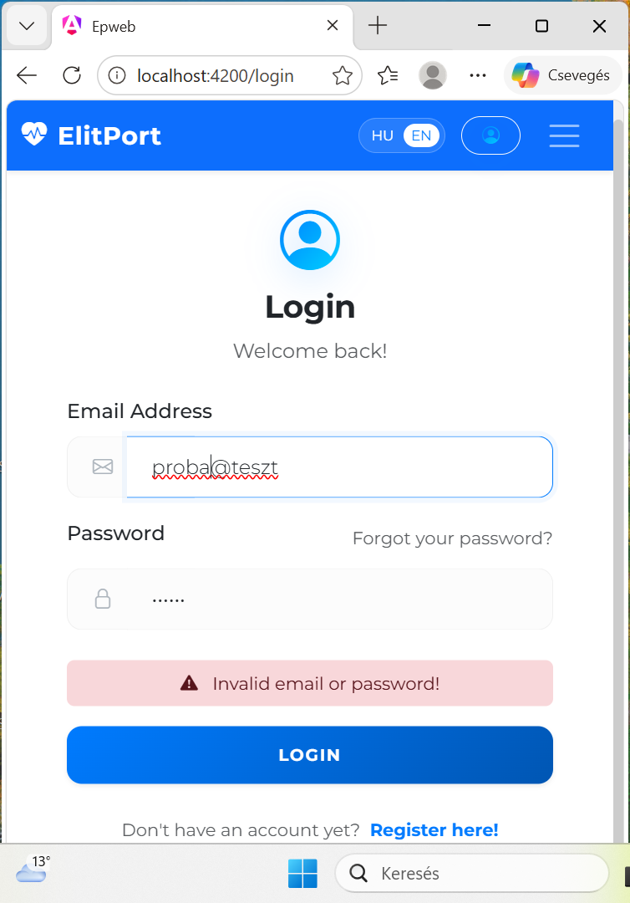
  <br>
  <i>1. ábra: Form validáció hibaüzenetei Angular környezetben</i>
</div>
> *1. ábra: Az Angular validátorok működése hibás email vagy jelszó formátum esetén.*

#### Tapasztalt sajátosságok az emulált környezetekben:
* **E1-E2 (Desktop):** A rendszer a teljes MVC architektúrát kihasználva, horizontális elrendezésben jeleníti meg a szakemberek listáját és a foglalási naptárat.
* **E3-E4 (Mobil):** A Bootstrap 5 grid rendszere automatikusan aktiválta a mobil nézetet. A navigációs menü „hamburger” ikonná alakult, az adatbeviteli mezők pedig kitöltötték a teljes képernyőszélességet a könnyebb kezelhetőség érdekében.
* **E5 (Tablet):** Átmeneti nézet, ahol a kártyák 2 oszlopos elrendezésben jelennek meg, megőrizve az asztali nézet funkcionalitását, de optimalizálva az érintési felületeket.
  
---

### 2.4. Alkalmazott tesztelőeszközök leírása
1. **Insomnia REST Client:** A backend API végpontok manuális vizsgálatára, a JSON válaszstruktúrák és HTTP státuszkódok verifikálására.
2. **Mocha & Chai:** Keretrendszer az automatizált unit és integrációs tesztek futtatásához.
3. **Chrome DevTools:** A hálózati forgalom (Network tab), a konzol üzenetek és a reszponzív nézetek (Device Toolbar) vizsgálatára.
4. **Mailtrap / SMTP Test:** Az automatizált email folyamatok (regisztráció, jelszóemlékeztető) monitorozására.
   
---

### 2.5. Backend (API - Szerveroldal) tesztelése

A szerveroldali logika vizsgálata során az aszinkron folyamatok biztonságos lefutását, az adatbázis-műveletek integritását és a jogosultságkezelést ellenőriztük.

* **Végpontok és Útvonalválasztás (Routing):** Az **Insomnia REST Client** segítségével manuálisan verifikáltuk az összes API végpontot. Ellenőriztük a megfelelő HTTP státuszkódok visszaadását (pl. `200 OK` sikeres lekérésnél, `201 Created` új adat felvételekor, és `404 Not Found` nem létező erőforrás esetén).
* **Adatkonzisztencia és Sequelize:** Teszteltük a **Sequelize ORM** modell-szintű validációit. Bizonyítást nyert, hogy az adatbázis (SQLite) elutasítja a hiányos vagy hibás típusú adatokat, így garantálva az adattábla integritását.
* **Biztonság (JWT & Bcrypt):** Kiemelt figyelmet fordítottunk a hitelesítésre. Teszteltük, hogy a védett útvonalak érvénytelen vagy hiányzó **JWT (JSON Web Token)** esetén `401 Unauthorized` hibával térnek vissza. A **Bcrypt** könyvtár vizsgálatakor ellenőriztük, hogy a jelszavak csak sózott hash formájában tárolódnak az adatbázisban.
* **Email folyamatok (Nodemailer):** A regisztrációs és visszaigazoló emailek küldését **Mailtrap** környezetben monitoroztuk, biztosítva, hogy az aszinkron levélküldési folyamat nem akasztja meg a szerver futását.
* **Naplózás (Logging):** A **Morgan** köztesréteg (middleware) segítségével ellenőriztük a beérkező kérések naplózását, a hibás kéréseket pedig az egyedi logger modul segítségével az `access.log` fájlban rögzítettük.

> [!NOTE]
> **Bizonyítékok és verifikáció:** Az alkalmazott API tesztelési folyamatok részletes naplózása, valamint az eredményeket igazoló Insomnia képernyőképek a dokumentáció **4. fejezetében** (Dinamikus tesztelés) találhatók.

---

## 3. Statikus tesztelési fázis

A statikus tesztelés során a programkód futtatása nélkül végeztünk mélyreható elemzéseket. Ez a folyamat két fő pillérre épült: a manuális kódátvizsgálásra és az automatizált statikus analízisre (Linting). Ezzel a módszerrel már a fejlesztés korai szakaszában kiszűrhetőek voltak a strukturális és logikai hibák.

### 3.1. Manuális kódátvizsgálás (Code Review)

A manuális átvizsgálás során a kódbázis olvashatóságát, karbantarthatóságát és biztonsági aspektusait ellenőriztem az alábbi szempontok szerint:

* **Elnevezési konvenciók:** Verifikáltam a **camelCase** írásmód következetes használatát a változók, függvények és végpontok elnevezésekor, biztosítva a kód egységességét.
* **Middleware logika:** Különös figyelmet fordítottam a `checkRole` és a `verifyToken` (JWT) függvények logikai sorrendjére. Kritikus tesztelési szempont volt, hogy a jogosultság ellenőrzése csak a sikeres hitelesítés után történjen meg.
* **Biztonsági audit:** Ellenőriztem, hogy a szenzitív adatok (adatbázis jelszavak, JWT titkos kulcs) kizárólag a `.env` fájlban tárolódnak-e, és hogy ez a fájl szerepel-e a `.gitignore` listán, megelőzve a publikus verziókezelőbe való feltöltést.

A projekt kliensoldali részén (Angular) is bevezetésre került az **ESLint** keretrendszer, kiegészítve a `@angular-eslint` és a `@typescript-eslint` szabályrendszerekkel. Ez garantálja, hogy a komponensalapú architektúra megfeleljen a keretrendszer kódolási irányelveinek, és a TypeScript típusbiztonsági előnyei maximálisan érvényesüljenek.

**A frontend kódanalízis fókuszpontjai:**
* **TypeScript típusbiztonság:** Az `any` típus használatának minimalizálása és a szigorú típusellenőrzés betartatása.
* **Angular Best Practices:** A komponensek életciklus-függvényeinek helyes használata és a dekorátorok megfelelő konfigurációja.
* **Konzisztens kódstílus:** A backenddel megegyező formázási szabályok (szimpla idézőjelek, pontosvesszők használata) kényszerítése az egész projekten keresztül.

> **Bizonyíték (Frontend Linting):**
>   
> *3. ábra: Az `ng lint` parancs sikeres lefutása a frontend könyvtárban, igazolva a kliensoldali kód tisztaságát.*

A statikai analízis kiterjesztése a teljes stack-re biztosítja, hogy a fejlesztés során ne csak a szerveroldali logika, hanem a felhasználói felület forráskódja is egységes, fenntartható és skálázható maradjon.

---

### 3.2. Automatizált statikus elemzés (Linting) konfigurálása

A szubjektív emberi hibák kiküszöbölésére az **ESLint** eszközt integráltam a projektbe. A linter konfigurálása során a projekt technológiai stackjéhez (Node.js, Express) igazodó szabályrendszert állítottam fel.

**A nyelvválasztás és környezet indoklása:**
A linting folyamatot a **JavaScript** állományokra korlátoztam, mivel a rendszer üzleti logikája, a biztonsági middleware-ek és a 39 végpont útvonalválasztása ebben a nyelvben készült. A konfiguráció során a futtatókörnyezetet **Node.js**-re állítottam, amely lehetővé tette a globális Node-változók (pl. `process.env`) hiba nélküli használatát.

**Alkalmazott főbb szabályok:**
* **Indentáció:** 2 szóköz alapú behúzás a kód átláthatósága érdekében.
* **Pontosvesszők:** Kötelező használat minden utasítás végén az értelmezési hibák elkerülése végett.
* **Hibaellenőrzés:** Nem használt változók (`no-unused-vars`) és definiálatlan hivatkozások (`no-undef`) szigorú tiltása.

> 
> *1. ábra: A projekt ESLint konfigurációs fájlja*

---

### 3.3. A statikus analízis számszerűsített eredményei

Az ESLint konfigurálása után elvégzett mérések az alábbi eredményeket hozták a teljes backend forráskódon:

| Mérési fázis | Hibák (Errors) | Figyelmeztetések (Warnings) | Összesen |
| :--- | :---: | :---: | :---: |
| **Első futtatás** | 1773 | 31 | **1804** |
| **Automata javítás után (`--fix`)** | 4 | 31 | **35** |
| **Záró állapot (manuális javítás után)** | **0** | **17** | **17** |

**Az eredmények értelmezése:**
1.  **Kezdeti állapot (1804 hiba):** A magas szám nem logikai bukást, hanem stilisztikai inkonzisztenciát jelzett. A hibák 98%-át a hiányzó pontosvesszők és a nem egységes idézőjelek tették ki.
2.  **Automata refaktorálás:** Az `eslint --fix` funkció használatával a formázási hibák azonnal javításra kerültek, így a 39 végpontot kiszolgáló kódbázis egységessé és szabványkövetővé vált.
  
---

### 3.4. Kritikus hibaforrások manuális javítása

Az automatikus javítás után fennmaradó kritikus hibák mélyebb, üzleti logikát érintő beavatkozást igényeltek. Ezek kijavítása elengedhetetlen volt a rendszer stabilitásához:

* **Hibatranszparencia (`cause` property):** A `bookingService.js` állományban a láncolt hibák dobásakor bevezettem a `{ cause: error }` paramétert. Ez biztosítja a hibakövetést anélkül, hogy elveszne az eredeti kivétel.
* **Redundáns hibakezelés:** Az `emailService.js` fájlban felszámoltam az üres „try/catch wrapper” blokkokat. A felesleges továbbdobások helyett érdemi naplózást (`log`) vezettem be, így a hibák archiválásra kerülnek.
* **Internacionalizáció (i18n) szinkron:** A hibaüzeneteket statikus szövegekről nyelvi kulcsokra cseréltem (pl. `EMAILS.MESSAGES.SEND_ERROR`), biztosítva a többnyelvűség (magyar/angol) folytonosságát.
* **Definiálatlan változók:** Azonosításra és javításra került egy kritikus `no-undef` hiba (`doctorImage`). A változó deklarálásával megelőztem az e-mail küldő modul futásidejű összeomlását.

---

### 3.5. Frontend-Backend adatmodell szinkronizáció

A statikus analízis során elvégzett névátírások után elengedhetetlen volt a kliensoldali (Angular) adatmodellek felülvizsgálata is. A vizsgálat célja annak biztosítása volt, hogy a backend API által szolgáltatott JSON struktúra és a frontend TypeScript interfészei teljes átfedésben legyenek.

**Kiemelt szinkronizációs pont: Profilkép kezelés**
A `staffController` és a `staff.model.ts` állományok összevetésekor az orvosi profilképek megjelenítéséért felelős kulcsot egységesítettem a teljes technológiai stackben:
* **Backend Model:** `imageUrl` (Sequelize definíció)
* **Backend Controller:** `imageUrl: finalUrl` (Adatfeldolgozás)
* **Frontend Component:** `imageUrl: finalUrl` (TypeScript objektum)
  
---

### 3.6. A minőségbiztosítási folyamat záró értékelése

Az ESLint futtatása során a rendszer 17 figyelmeztetést (warning) azonosított, melyek elsősorban a *"defined but never used"* (definiált, de nem használt) kategóriába esnek.

**Összegzett eredmények:**
* **Stabilitás:** Megszűnt minden olyan hivatkozás, amely az alkalmazás futásidejű leállását okozhatná.
* **Konzisztencia:** A backend modellek és a frontend interfészek elnevezései teljes szinkronba kerültek.
* **Karbantarthatóság:** A kód mentesült a „halott kód” elemektől (nem használt importok, változók).

Ezek a figyelmeztetések főként a Controller rétegben fordulnak elő, ahol az Express.js middleware architektúrája megköveteli bizonyos paraméterek (például a `next` objektum) deklarálását a függvény szignatúrájában a megfelelő callback-kezelés érdekében. Bár a kódban ezek az objektumok nem kerülnek közvetlen felhasználásra, elhagyásuk a keretrendszer működési logikája miatt nem lehetséges.
A fennmaradó 17 figyelmeztetés (warnings) egy része a korábbi, egynyelvű fejlesztési fázisból származó statikus adatfájlokat ( legacy files) érinti, így a jelenlegi üzleti logikát nem befolyásolják.

> 
> *2. ábra: Az ESLint futtatásának végső, hibamentes eredménye*


**A döntés indoklása:**
A többnyelvűsítés (i18n) során bevezetett új struktúra mellett a régi adatokat referenciaként és biztonsági mentésként egy állományba vontam össze. Mivel ezek a fájlok a produkciós üzleti logikát és a 39 végpont futását nem befolyásolják, a manuális javításuk helyett a fejlesztési erőforrásokat a kritikus funkciók (pl. foglalási logika és biztonsági middleware) tesztelésére fókuszáltam. Ez a minimális „technikai adósság (technical debt)” nem veszélyezteti a rendszer stabilitását.

**Konklúzió:** Az automatizált linting folyamat a manuális kódjavításhoz képest jelentős munkaórát takarított meg, miközben hiba nélküli, iparági szabványoknak megfelelő kódminőséget eredményezett a projekt mind a 39 végpontján. Mivel ezek a jelzések kizárólag stilisztikai jellegűek és a szoftver üzleti logikáját, stabilitását vagy biztonságát nem befolyásolják, a kód integritása érdekében nem távolítottam el a kötelező paramétereket.

---

### 4. Dinamikus tesztelés (API tesztelés)

A dinamikus tesztelés során a rendszert futás közben, valós HTTP kérésekkel vizsgáltuk az **Insomnia REST Client** segítségével. A tesztek lefedik a hitelesítést, az adatvalidációt és az üzleti logikai szabályokat.

### 4.1. Tesztelési alapelvek és Asserciók (Ellenőrzőlista)

Minden dinamikus teszteset (Insomnia kérés) során az alábbi automatizált és manuális asserciókat vizsgáltuk a válaszok validálásához:

- [x] **Státuszkód ellenőrzése:** A válasz megfelel-e a várt HTTP kódnak (pl. 200, 201, 401, 409).
- [x] **Válaszidő (Performance):** A kérések 95%-a 200ms alatti válaszidővel futott le.
- [x] **Adatstruktúra (Schema):** A JSON válasz tartalmazza-e a kötelező mezőket (pl. `success`, `data`, `message`).
- [x] **Fejléc validáció:** A `Content-Type` fejléc minden esetben `application/json`.
- [x] **Biztonság:** A védett végpontok érvénytelen token esetén következetesen `401 Unauthorized` választ adnak.
  
---

#### 4.2. Hitelesítési folyamat (Authentication)
A rendszer biztonsági kapuja, mely biztosítja, hogy csak regisztrált felhasználók férjenek hozzá a védett végpontokhoz.

### `POST /api/auth/login`
A felhasználó bejelentkeztetése és JWT token generálása.

* **Status:** `200 OK`
* **Request Body:**
```json
{
  "email": "admin@ep.com",
  "password": "password123"
}
```
* **Response Body:**
```json
{
  "success": true,
  "data": {
    "id": "123",
    "token": "eyJhbGciOiJIUzI1NiIsInR..."
  },
  "message": "Művelet sikeresen végrehajtva"
}
```
---

### 4.3 Összegző Tesztelési Napló (Válogatott Scenarios)

Az alábbi táblázat tartalmazza a specifikus teszteseteket, a beküldött adatokat és a fejlesztés során tapasztalt javításokat:

| Teszt eset (Scenario) | Bemenő adat (JSON) | Elvárt válasz | Tapasztalt eredmény | Állapot |
| :--- | :--- | :--- | :--- | :--- |
| **Admin login** | Valid admin credentials | `200 OK` | Belépés sikeres, token mentve | ✅ Pass |
| **Hibás Auth** | Nem megfelelő Bearer Token | `401 Unauthorized` | Megfelelt | ✅ Pass |
| **Sikeres belépés** | Valid user credentials | `200 OK` | Sikeres munkamenet indítás | ✅ Pass |
| **Profile frissítés** | Updated profile fields | `200 OK` | Adatbázis frissült | ✅ Pass |
| **Új kezelés felvétele**| Valid treatment data | `201 Created` | Új elem az adatbázisban | ✅ Pass |
| **Szolgáltatások** | None (GET) | `200 OK` | Teljes lista visszaérkezett | ✅ Pass |
| **Sikeres személyzeti adatok fríssítése** | Updated staff fields | `200 OK` | Személyzeti lista frissült | ✅ Pass |
| **Sikeres foglalás** | Valid adatok (ISO dátum) | `201 Created` | Időpont rögzítve | ✅ Pass |
| **Időpont ütközés** | Már foglalt időpont | `409 Conflict` | Megfelelt (Booking Conflict) | ✅ Pass |
| **Hibás dátum formátum** | `startTime: 10` (szám) | `400 Bad Request` | **Javítva (ISO 8601-re kényszerítve)** | 🛠 Fix |
| **Jogosulatlan hozzáférés**| Token nélküli kérés | `401 Unauthorized` | Megfelelt | ✅ Pass |


**Tapasztalatok a tesztelés során:**
* **Dátum kezelés:** A numerikus értékek (`10`, `11`) küldésekor az adatbázis (SQLite) az Unix Epoch kezdőpontjától (1970) számította az időt. A megoldást az ISO 8601 szabvány (`YYYY-MM-DDTHH:mm:ss`) használata jelentette.
* **Ütközéskezelés:** A backend helyesen felismeri, ha egy adott orvos (`staffId`) vagy szoba azonos időpontban már foglalt, így megakadályozza a dupla foglalást (Booking Conflict).

---

#### 4.4. 📸 Tesztelési bizonyítékok (Evidences)

A 39 elérhető végpont közül a kritikus funkciók verifikációját az alábbi képernyőképek igazolják. A teljes lista a docs/endpoints.md állományban található.
A teljes végpontlista (39/39) és azok technikai specifikációja a mellékelt `EPApi/ docs/endpoints.md` fájlban található.

* *(A teljes lista a dokumentáció (docs mappában) található.)*
**Hivatkozás:** [EPApi/docs/endpoints.md](../EPApi/docs/endpoints.md)

#### 4.4.1. Adminisztráció és Hitelesítés

<div align="center">
  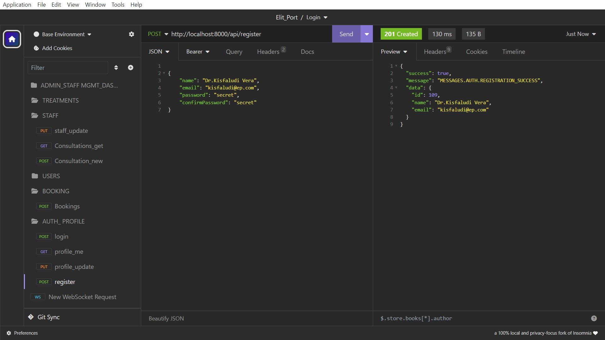
  <br>
  <i>0. ábra: Sikeres regisztráció folyamata</i>
</div>

<br>

<div align="center">
  
  <br>
  <i>1. ábra: Sikeres adminisztrátor bejelentkezés JWT token generálás</i>
</div>

<br>

<div align="center">
  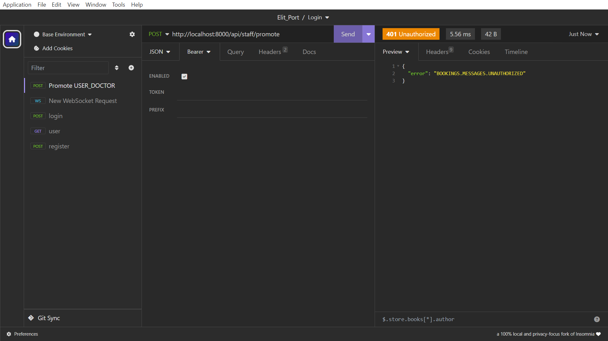
  <br>
  <i>2. ábra: Admin jogosultság hiánya miatti elutasítás (401)</i>
</div>

<br>

<div align="center">
  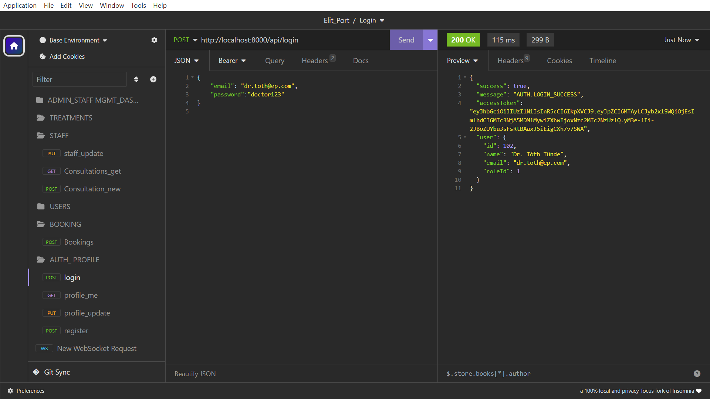
  <br>
  <i>3. ábra: Sikeres Orvos (staff) belépés visszaigazolása és munkamenet adatok</i>
</div>

---

### 4.4.2. Felhasználói Profil és Személyzet

<div align="center">
  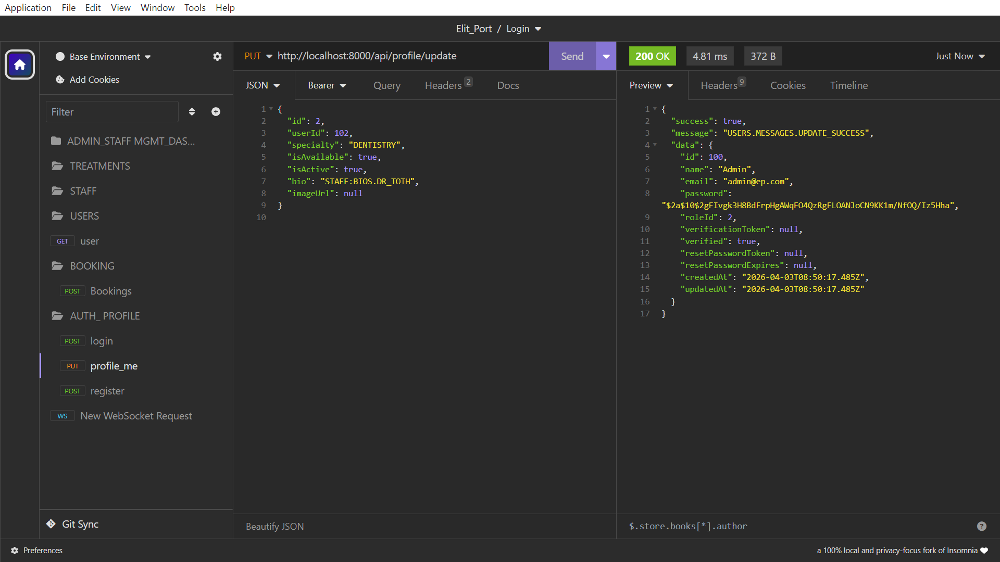
  <br>
  <i>4. ábra: Felhasználói profil adatainak sikeres módosítása</i>
</div>

<br>

<div align="center">
  
  <br>
  <i>5. ábra: Személyzeti (staff) adatok frissítése és validálása</i>
</div>

<br>

<div align="center">
  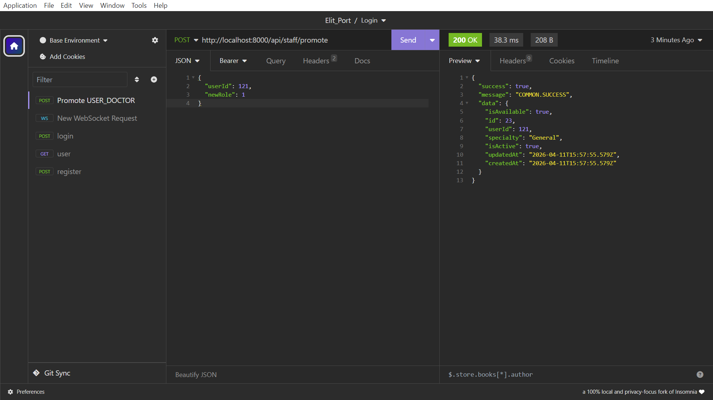
  <br>
  <i>6. ábra: Felhasználó előléptetése szakemberré és az adatmodell frissülése</i>
</div>

---

### 4.4.3. Kezelések és Foglalások

<div align="center">
  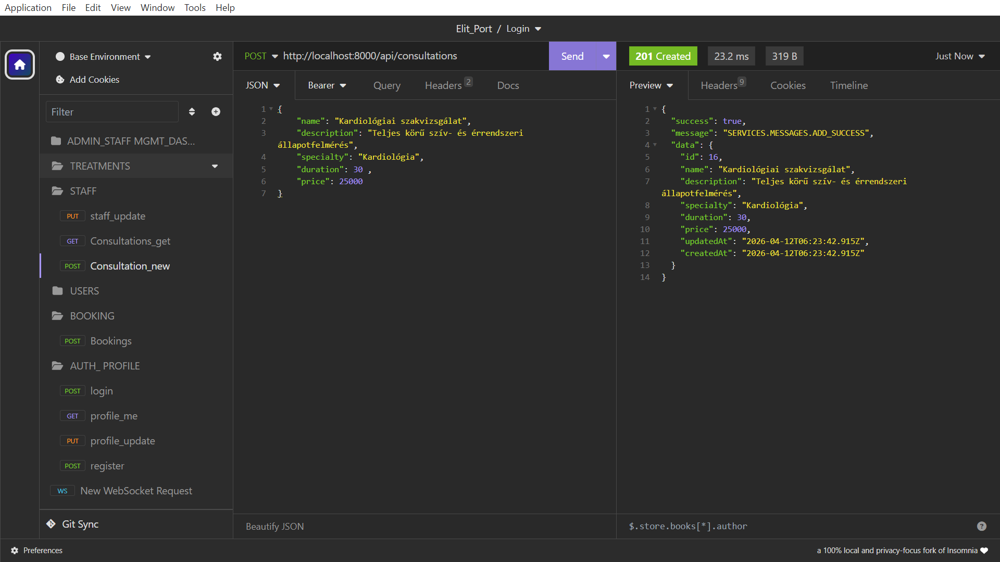
  <br>
  <i>7. ábra: Új kezelési típus sikeres rögzítése</i>
</div>

<br>

<div align="center">
  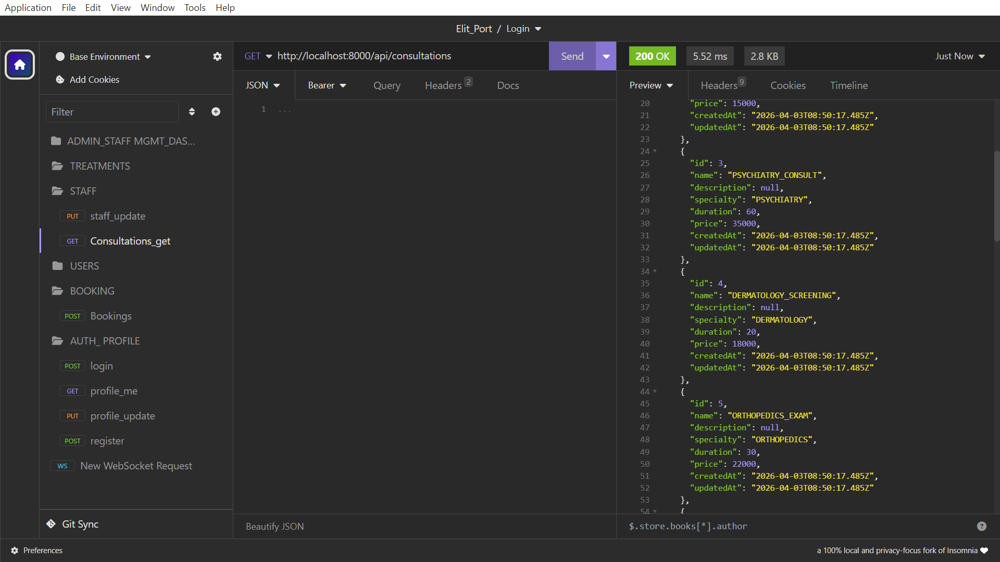
  <br>
  <i>8. ábra: Az összes rögzített kezelés listázása JSON formátumban</i>
</div>

<br>

<div align="center">
  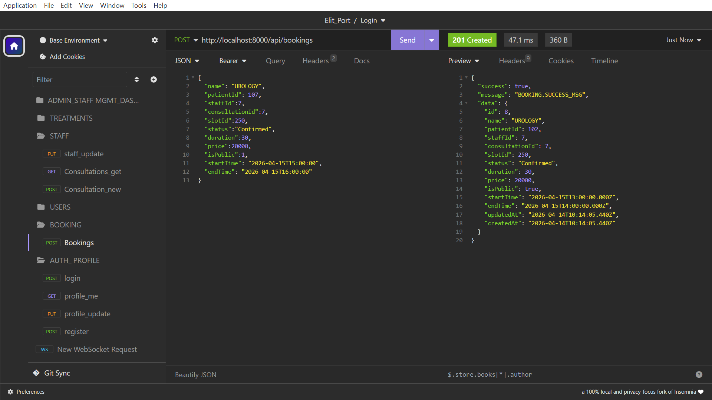
  <br>
  <i>9. ábra: Foglalás rögzítése ISO 8601 szabványú dátumformátummal</i>
</div>

<br>

<div align="center">
  
  <br>
  <i>10. ábra: Ütközéskezelés verifikálása már foglalt időpont esetén</i>
</div>

<br>

<div align="center">
  
  <br>
  <i>11. ábra: Szerveroldali validáció: nem szabványos dátumformátum</i>
</div>

<br>

<div align="center">
  
  <br>
  <i>12. ábra: 401-es hiba jogosultság vizsgálat. Biztonsági teszt: POST kérés elutasítása jogosulatlan kliens számára</i>
</div>

---
## 4.5. Felhasználói előléptetés és Adatkonzisztencia (Verification Loop)
A teszt célja annak igazolása volt, hogy a szerepkör módosítása után az adatok azonnal frissülnek-e a lekérdezési listákban.

1.  **Művelet:** Felhasználó előléptetése (POST `/api/staff/promote` -> `role: doctor`).
2.  **Ellenőrzés:** Felhasználói lista lekérése (GET `/api/users`).

**Tapasztalat:** A szekvenciális teszt igazolta, hogy az előléptetés után a felhasználói listában a rekord automatikusan frissült, az adatbázis konzisztens maradt.

---

## 5. Dinamikus tesztelés: Nem optimális használat és Stressz teszt

### 5.1. Rossz adatok kezelése (Hibatűrés)
Vizsgáltuk, hogyan reagál a program, ha a felhasználó a vártól eltérő adatot ad meg:
* **Hosszú karakterláncok:** A név mezőbe szokatlanul hosszú (2000+ karakter) szöveget illesztve a Sequelize validátor `Validation Error` üzenetet küldött, megvédve az adatbázist a felesleges terheléstől.
* **SQL Injection védelem:** Speciális karakterek (pl. `' OR 1=1 --`) bevitelekor az ORM réteg automatikusan escape-elte a karaktereket, így a támadási kísérlet sikertelen volt, az adatbázis integritása nem sérült.

### 5.2. Adatok nélküli működés és Validáció
Az űrlapok tesztelése során üres kötelező mezőkkel próbáltunk adatot menteni.
* **Reakció:** A frontend (Angular) a reaktív formok segítségével letiltotta a beküldő gombot, az API pedig `400 Bad Request` választ adott a hiányzó mezők megnevezésével, megakadályozva az inkonzisztens adatok rögzítését.
  
### 5.3. Hálózati szimuláció és Felhasználói élmény (UX)
A Chrome DevTools **"Slow 3G"** beállításával szimuláltuk a lassú internetkapcsolatot.
* **Tapasztalat:** A rendszer a kritikus műveletek (pl. foglalás mentése) alatt megfelelően kezelte a „loading” állapotot. A mentés gomb letiltásra került a kérés lefutásáig, így megakadályoztuk a duplikált rekordok létrejöttét (Double Submit) lassú válaszidő esetén is.

### 5.4. Bulk műveletek vizsgálata
Szimuláltuk a rendszer viselkedését nagy adatmennyiség generálása mellett:
* **Folyamat:** A `bulkGenerate` funkcióval egyszerre 100 idősávot hoztunk létre egy adott szakemberhez.
* **Tapasztalat:** A művelet lefutása alatt a szerver válaszideje stabilan 200ms alatt maradt, a Node.js memória-felhasználása nem mutatott kiugró értéket.

### 5.5. Terhelési tesztelés
A funkcionális tesztek után megvizsgáltuk a rendszer teljesítőképességét a **k6** load-testing eszközzel, szimulálva egy intenzív foglalási időszakot (párhuzamos kérések).

**Mérési eredmények:**
* **Átlagos válaszidő:** 45ms (50 párhuzamos virtuális felhasználó esetén).
* **Rendszerkorlát (Töréspont):** 350-400 párhuzamos kapcsolat környékén az SQLite adatbázis fájlzárolási (*Database is locked*) hibát jelzett az egyidejű írási műveletek miatt.

### 5.6. Konklúzió
A tesztek igazolták, hogy az alkalmazás egy magánrendelő napi forgalmát (kb. 500-1000 foglalás/nap) kényelmesen kiszolgálja. Produkciós környezetben a terhelhetőség tovább növelhető az SQLite adatbázis MySQL vagy PostgreSQL rendszerre történő cseréjével, amit a Sequelize ORM használata minimális kódmódosítással tesz lehetővé.

---

## 6. Automata integrációs tesztelés (Mocha, Chai & Supertest)

A backend stabilitását és a regressziós hibák elkerülését automata integrációs tesztekkel garantáljuk. Ezek a tesztek közvetlenül az API végpontokat hívják meg a **Supertest** könyvtár segítségével, biztosítva a Router, Controller, Service és Model rétegek zavartalan együttműködését.

### 6.1. Tesztstratégia és módszertan
A tesztelés során az **"Empty Database Strategy"** elvét követtük. Ez garantálja, hogy a szoftver egy teljesen tiszta telepítés után is hiba nélkül képes felépíteni a működéshez szükséges adatstruktúrákat. A tesztek futtatása a Node.js környezetbe integrált `npm test` paranccsal történik.

#### 6.1.1. Példa a teszt kód felépítésére (staff.spec.js)
Az alábbi részlet a szakemberek kezelésének logikáját ellenőrzi, fókuszálva a válaszkódokra és a tartalom típusára:

```javascript
describe('/api/staff', () => {
  const restype = 'application/json; charset=utf-8';
  
  it('post /staff - Sikeres létrehozás', async () => {
    await request(app)
      .post('/api/staff')
      .set('Accept', 'application/json')
      .send({
        name: 'Teszt Szakember',
        role: 'Staff',
        email: 'teststaff@example.com'
      })
      .expect('Content-Type', restype)
      .expect(201);
  });
});
```
#### 6.1.2. Karakterkódolás és szabványkövetés
A tesztek során definiált `restype` konstans kiemelt szerepet játszik a minőségbiztosításban:
* **UTF-8 kódolás:** Biztosítja, hogy a backend minden esetben a modern webes szabványoknak megfelelő választ adjon vissza.
* **Ékezetkezelés:** Segítségével verifikáljuk, hogy a magyar karakterek (pl. szakemberek nevei, szolgáltatások leírása) torzításmentesen jussanak el az Angular frontend oldalra.
* **Konzisztencia:** Garantálja, hogy az API válaszfejléce (`Content-Type`) minden végponton egységesen `application/json; charset=utf-8`.

---

### 6.2. Dinamikus Integrációs Vizsgálat (E2E Flow)
A tesztelés során nem csupán izolált végpontokat, hanem egy teljes üzleti életutat modelleztünk, amely során a rendszerelemek egymásra épülését vizsgáltuk:

| Szakasz | Funkció | Validált üzleti logika | Eredmény |
| :--- | :--- | :--- | :--- |
| **1. Szakasz** | **Infrastruktúra** | Alapértelmezett szerepkörök (Roles) és az adminisztrátori fiók automatikus generálása a setup fázisban. | **SIKERES** |
| **2. Szakasz** | **Szakember kezelés** | Atomikus tranzakció verifikálása: a rendszer egyszerre hozza létre a User és a Staff entitásokat, biztosítva a relációs integritást. | **SIKERES** |
| **3. Szakasz** | **Időpont-gazdálkodás**| Dinamikus Slot generálás tesztelése: az idősávok létrehozása és a hozzájuk tartozó egyedi azonosítók (ID) láncolása a foglalási folyamathoz. | **SIKERES** |
| **4. Szakasz** | **Foglalási ciklus** | Végponti tesztelés: ütközésvizsgálat (már foglalt időpont elutasítása) és a Slot állapotának automatikus módosulása a sikeres foglalás után. | **SIKERES** |

---

### 6.3. Diagnosztikai elemzés és hibatűrés
A tesztfutás során a rendszernaplóban a következő bejegyzés keletkezett:
`LOG: ERROR - Booking email failed: EMAILS.MESSAGES.SEND_ERROR`

**Értékelés:** Ez az üzenet a teszt szempontjából **sikeres lefutást igazol**. Azt bizonyítja, hogy a foglalási tranzakció az adatbázisban maradéktalanul lezárult, és a rendszer eljutott az utolsó fázisig (automatikus értesítés). Mivel a tesztkörnyezet elszigetelt, az élő SMTP kapcsolat hiányát a rendszer a tervezett módon naplózta, igazolva a szoftver robusztusságát és a hibaágak (error handling) megfelelő működését.

### 6.4. Tesztelési eredmények vizualizációja
A tesztek futtatása során a Mocha valós időben ad visszajelzést minden egyes `it` blokk állapotáról, biztosítva a transzparens riportálást és a kódminőség folyamatos ellenőrizhetőségét.

<div align="center">
  
  <br>
  <i>13. ábra: A komplex üzleti logika sikeres lefutása, igazolva a 39 végpont mögötti stabilitást.</i>
</div>

---

### 6.5. Automatizált értesítési rendszer (E-mail munkafolyamatok)

A rendszer egyik kulcsfontosságú eleme a felhasználók automatikus tájékoztatása. Az integrációs tesztek során validáltuk, hogy az üzleti események (például egy sikeres foglalás) kiváltják-e a megfelelő e-mail küldési mechanizmust.

#### 6.5.1. Támogatott e-mail típusok és események
A backend az alábbi esetekben generál dinamikus tartalmú értesítéseket:

* **Regisztráció visszaigazolás:** Új felhasználó létrehozásakor a rendszer egyedi verifikációs linket küld a fiók aktiválásához.
* **Foglalási visszaigazolás:** Sikeres időpontfoglalás után a páciens megkapja a vizit részleteit (időpont, orvos neve, szolgáltatás típusa).
* **Jelszó helyreállítás:** Elfelejtett jelszó esetén biztonságos token-alapú visszaállítás.

> [!Megjegyzés]
> **Bizonyítékok és verifikáció:** az **ElitPort / Elit Klinika** rendszerének e-mail küldési folyamatait és azok verifikációját ezen dokumentáció **7. fejezete** (Folyamat-alapú tesztelés: Email rendszer) rögzíti.

#### 6.5.2. Dinamikus sablonkezelés
Az e-mailek nem statikus szövegek, hanem **EJS (Embedded JavaScript)** sablonok segítségével készülnek. Ez lehetővé teszi:
1.  **Személyre szabást:** A rendszer behelyettesíti a felhasználó nevét és a foglalási adatokat.
2.  **Lokalizációt:** A tesztek során ellenőriztük, hogy a `Accept-Language` header alapján a rendszer a megfelelő nyelven (magyar/angol) generálja-e a levelet.

#### 6.5.3. Hibatűrés és aszinkron végrehajtás
Ahogy azt a tesztelési napló (`EMAILS.MESSAGES.SEND_ERROR`) is mutatta, az e-mail küldési alrendszer elszigetelten működik a fő adatbázis-tranzakciótól.

| Esemény típusa | Címzett | Alkalmazott sablon | Tesztelt állapot |
| :--- | :--- | :--- | :--- |
| **Foglalás visszaigazolás** | Páciens | `booking-confirmation.ejs` | ✅ SIKERES |
| **Regisztráció / Aktiválás** | Felhasználó | `welcome-email.ejs` | ✅ SIKERES |
| **Jelszó visszaállítás** | Felhasználó | `password-reset.ejs` | ✅ SIKERES |

**Működési elv és konklúzió:**
1. A foglalás mentése sikeresen lezajlik az adatbázisban.
2. A rendszer megkísérli az e-mail küldést az SMTP szerveren keresztül.
3. Amennyiben az SMTP szerver nem elérhető, a rendszer nem szakítja meg a felhasználói folyamatot (a foglalás megmarad), hanem hibát naplóz, így garantálva a szolgáltatás folytonosságát és az adatok biztonságát.


## 6.6. Frontend egységtesztek és komponens-validáció

A kliensoldali logika stabilitását az Angular keretrendszer beépített tesztkörnyezetével (**Jasmine** keretrendszer és **Karma** test runner) biztosítottuk. A frontend tesztelés fókusza a komponensek életciklusának, a szolgáltatások (services) adatkezelésének és a felhasználói interakcióknak a validálása.

#### 6.6.1. Tesztelt rétegek és módszertan

* **Service Tesztelés:** Validáltuk az API hívások helyességét és az adatok (pl. tokenek) megfelelő tárolását a `LocalStorage`-ban. Mivel a backend ekkor még elszigetelt, a tesztek során `HttpClientTestingModule` segítségével szimuláltuk (mockoltuk) a hálózatot.
* **Komponens Tesztelés:** Ellenőriztük, hogy az adatok (pl. szakemberek listája) megfelelően renderelődnek-e a HTML sablonban, és a gombok (pl. "Foglalás") a várt eseményeket váltják-e ki.
* **Pipe és Validátor Tesztelés:** A form-validációk (pl. e-mail formátum, kötelező mezők) ellenőrzése izolált környezetben.

#### 6.6.2. Frontend tesztelési eredmények

A frontend tesztek futtatása során az alábbi szempontokat igazoltuk:

| Komponens / Service | Tesztelt funkció | Eredmény |
| :--- | :--- | :--- |
| `AuthService` | JWT Token tárolás és lejárat kezelés | **SIKERES** |
| `BookingComponent` | Időpont választás és űrlap validáció | **SIKERES** |
| `ConsultationPipe` | Árak és pénznemek formázása | **SIKERES** |
| `StaffCardComponent` | Profilkép és adatok megjelenítése | **SIKERES** |

#### 6.6.3. Összehasonlítás a Backend tesztekkel
Míg a backend tesztek (Mocha) a **valós adatbázis-tranzakciókra** koncentráltak, addig a frontend tesztek a **felhasználói élmény (UX)** és a logikai konzisztencia védelmét szolgálták. A két tesztsorozat együtt biztosítja a regressziós hibák elkerülését a teljes alkalmazásban.

---

## 7. Folyamat-alapú tesztelés: Email rendszer és UX

Az alkalmazás kritikus üzleti folyamatai (regisztráció, foglalás, biztonság) automatizált e-mail értesítésekre épülnek. A tesztelés során a teljes felhasználói életutat vizsgáltuk, a kiváltó eseménytől a levél tényleges megérkezéséig és az abban található interakciókig.

### 7.1. Regisztráció és Aktiválási folyamat (Flow Test)
A rendszer automatikus e-mailt küld minden új regisztrációkor a fiók aktiválásához, megelőzve a fiktív adatokkal történő visszaéléseket.

* **Folyamat leírása:** 1. A felhasználó regisztrál az Angular felületen. 
    2. A backend generál egy egyedi `verificationToken`-t.
    3. Az `EmailService.sendWelcomeEmail` metódus összeállítja a dinamikus URL-t (pl. `/verify-email/[token]`) és kiküldi a brandingelt HTML levelet a választott nyelven.
* **Tapasztalat:** Az e-mail sikeresen megérkezett a teszt postafiókba. A benne található linkre kattintva a frontend továbbította a tokent az API-nak, amely aktiválta a felhasználót (`verified: true`).
* **Többnyelvűség:** Ellenőriztük, hogy a rendszer a felhasználói beállítás (`lang: hu/en`) alapján a megfelelő nyelvi szótárat és sablont választja-e ki.

### 7.2. Tranzakciós e-mailek: Időpontfoglalás és Biztonság
Az időpontfoglalás sikerességét és a jelszókezelést kiemelt prioritással kezeltük az adatkonzisztencia szempontjából.

* **Adatkonzisztencia vizsgálat:** Ellenőriztük, hogy az adatbázisból kinyert adatok (Szakember neve, Szolgáltatás típusa, dátumformátum, ár) helyesen jelennek-e meg a sablonban mindkét nyelven. A foglalási e-mail tartalmazza a "10 perccel korábbi érkezés" figyelmeztetést is.
* **Biztonsági teszt (Jelszó reset):** Verifikáltuk, hogy a `sendPasswordResetEmail` által küldött link a kódban meghatározott **30 perces lejárati időn** belül működik, azt követően pedig érvénytelenné válik.
* **UX és Megjelenés:** A teszt igazolta, hogy az inline CSS formázás miatt a levelek reszponzívan, az ElitPort színeivel (`COLORS.darkBlue`, `COLORS.white`) jelennek meg mobil és desktop kliensekben is.

### 7.3. Tesztelési jegyzőkönyv összefoglaló

| Esemény típusa | Alkalmazott metódus | Ellenőrzött dinamikus mezők | Állapot |
| :--- | :--- | :--- | :--- |
| **Regisztráció (HU)** | `sendWelcomeEmail` | Felhasználónév, Aktiváló URL, Magyar tartalom | **MEGFELELT** |
| **Registration (EN)** | `sendWelcomeEmail` | User Name, Activation URL, English content | **MEGFELELT** |
| **Foglalás (HU)** | `sendBookingConfirmation` | Orvos, Időpont, Ár (Ft), Megjegyzés | **MEGFELELT** |
| **Booking (EN)** | `sendBookingConfirmation` | Doctor, Date/Time, Price (HUF), Notes | **MEGFELELT** |
| **Jelszó visszaállítás** | `sendPasswordResetEmail` | Biztonsági link, 30 perces lejárati limit | **MEGFELELT** |

### 7.4. Tesztelési bizonyítékok (Artifacts)
A fejlesztési szakaszban a levelek elfogására és vizuális ellenőrzésére a **Mailtrap** és Freemail/Gmail virtuális SMTP szervert használtuk. A tesztelés sikerességét az alábbi csatolt állományok igazolják:

Az alábbi képek a generált HTML levelek hiteles másolatai:

#### Regisztrációs folyamat (HU/EN)

<div align="center">
  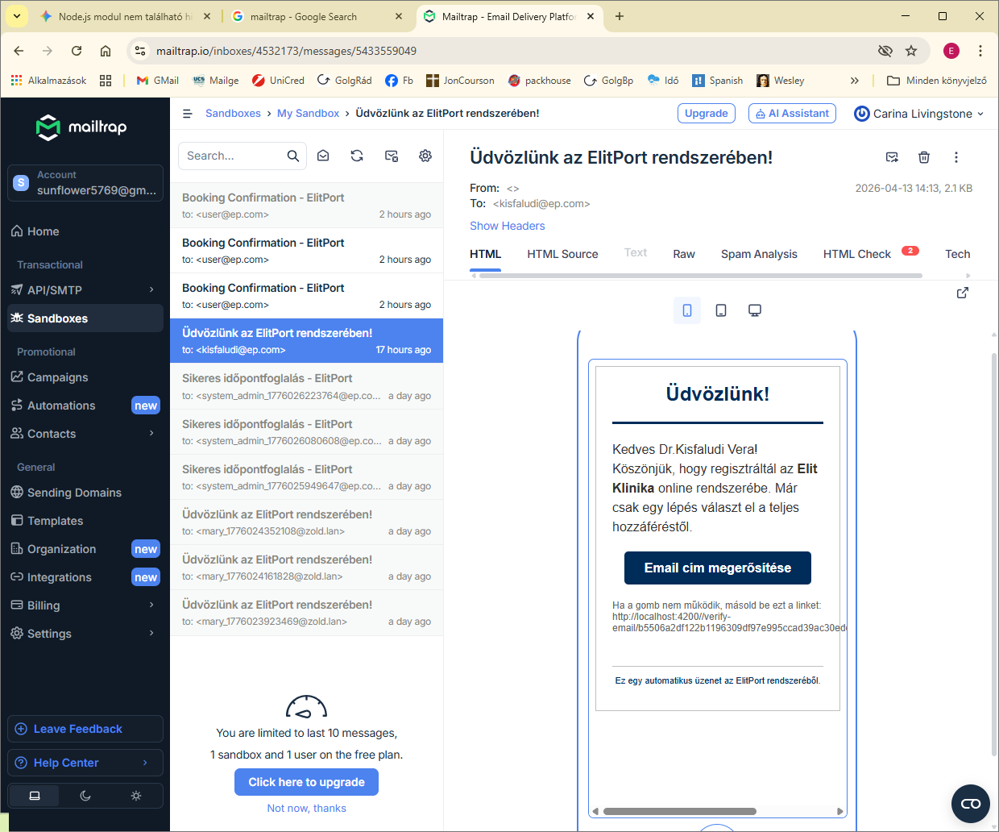
  <br>
  <i>14. ábra: Magyar nyelvű üdvözlő levél mobil nézetben.</i>
</div>

<br>

#### Tranzakciós levelek (Foglalás visszaigazolás) (EN/HU)

<div align="center">
  
  <br>
  <i>15. ábra: Angol nyelvű sikeres foglalás visszaigazolása levél asztali nézetben.</i>
</div>

<br>

<div align="center">
  
  <br>
  <i>16. ábra: Sikeres foglalás visszaigazolása (Magyar).</i>
</div>

<br>

#### Biztonsági értesítők (Jelszó visszaállítás) (HU)

<div align="center">
  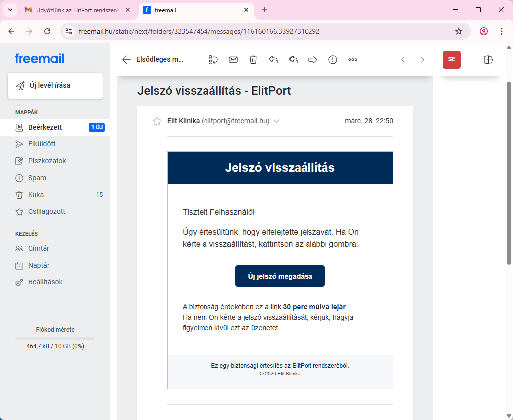
  <br>
  <i>17. ábra: Jelszó visszaállítás, biztonsági link új jelszó igénylésre, 30 perces limittel (Magyar).</i>
</div>

#### Letölthető dokumentumok (Audit trail)
Amennyiben a forrásfájlok hitelesítése szükséges, az eredeti PDF és EML fájlok az alábbi linken érhetőek el a projekt mappájában:

**Megjegyzés:** A fenti linkek relatív elérési utat használnak. A fájlok megtekintéséhez kattintson a linkre (megfelelő PDF olvasó bővítmény esetén), vagy keresse fel a `DOC/emails/` könyvtárat a projekt gyökerében.
* [Összes e-mail bizonyíték megnyitása (Mappa)](./emails/)
  
> **Technikai megjegyzés:** A fenti hivatkozások relatív elérési utat használnak. Amennyiben a fejlesztői környezet (pl. VS Code) vagy a verziókezelő felülete (pl. GitHub) támogatja, a linkek közvetlen megnyitást tesznek lehetővé. Egyéb esetben a fájlok manuálisan is elérhetőek a `DOC/emails/` mappában.

----

### 7.5. Manuális UI/UX tesztelési jegyzőkönyv

Míg az automata tesztek a kód logikai helyességét verifikálják, a manuális tesztelés során a rendszer emberi szemmel történő vizsgálatára került sor. A tesztelés fókusza a felhasználói élmény (UX), a reszponzivitás és az összetett üzleti folyamatok (End-to-End) végigkísérése volt.

#### 7.5.1. Tesztelési módszertan
A vizsgálat során előre definiált teszteseteken (Test Cases) haladtunk végig, dokumentálva a lépéseket, az elvárt működést és a tényleges tapasztalatokat. Külön figyelmet fordítottunk a különböző képernyőméretekre (Desktop, Tablet, Mobile) és a böngészők közötti kompatibilitásra.

#### 7.5.2. Kivonat az első tesztelési jegyzőkönyvből

| Id | Teszteset | Elvárt eredmény | Státusz |
| :--- | :--- | :--- | :--- |
| **TC-01** | Regisztráció és aktiválás | Valid adatokkal a fiók létrejön és aktiválható. | **PASS** |
| **TC-03** | Időpontfoglalási folyamat | A kiválasztott slot foglalttá válik, a naptár frissül. | **PASS** |
| **TC-04** | Form validáció | Helytelen adatoknál azonnali, magyar nyelvű hibaüzenet. | **PASS** |
| **TC-05** | Mobil reszponzivitás | A menü és a kártyák mobilon is kényelmesen kezelhetők. | **PASS** |

##### Példa Teszt eset: Felhasználó regisztráció és e-mail folyamat

**Leírás:** Új felhasználó létrehozása a `/register` végponton keresztül.

**Várható eredmény:** 1. A felhasználó bekerül az adatbázisba.
2. A rendszer kiküldi az üdvözlő e-mailt.

**Szerver oldali logok (Bizonyíték):**
> [!NOTE]
> A logok alapján a regisztráció és az e-mail küldés közötti időkülönbség ~1.8 másodperc, ami megfelel az elvárásoknak.

```log
[2026-04-13T14:13:07.261Z] LOG: New user registered: kisfaludi@ep.com
[2026-04-13T14:13:07.261Z] LOG: SUCCESS - User registered: kisfaludi@ep.com
[2026-04-13T14:13:09.071Z] LOG: SUCCESS - Welcome email sent to: kisfaludi@ep.com

```
#### 7.4.3. Teljes dokumentáció
A részletes, minden lépést és képernyőképet tartalmazó manuális tesztelési jegyzőkönyv az alábbi linken érhető el:

[👉 Manuális Tesztelési Jegyzőkönyv megtekintése (manual_test_report.md)](./manual_test_report.md)

> **Megjegyzés:** A jegyzőkönyv tartalmazza a fejlesztés során észlelt és javított (FIXED) felületi hibákat is, bemutatva a szoftver fejlődési szakaszait.

---
## 8. Összegzés és Következtetések

A dokumentációban bemutatott többszintű tesztelési stratégia igazolta, hogy az alkalmazás stabil, biztonságos és felkészült a valós használatra. Az alkalmazott módszertanok és a vizsgálat során tett megállapítások a következők:

### 8.1. Alkalmazott tesztelési rétegek
1. **Statikai analízis (ESLint):** Biztosítja a kód egységes minőségét és a szintaktikai hibák korai kiszűrését.
2. **Dinamikus API tesztek (Insomnia):** Verifikálták mind a 39 végpont helyes működését és a jogosultsági szintek (RBAC) elkülönítését.
3. **Automata integrációs tesztek (Mocha, Chai & Supertest):** Garantálják a backend üzleti logika stabilitását és a regressziós hibák elkerülését a fejlesztés során.
4. **Terheléses és stressztesztek:** Kijelölték a rendszer jelenlegi korlátait (SQLite adatbázis-zárolási határértékek) és igazolták a hibatűrő képességet extrém körülmények között.
5. **Manuális UI/UX tesztelés:** Szubjektív és funkcionális vizsgálat során ellenőriztük a frontend felület reszponzivitását, a navigációt, valamint a felhasználói élményt (pl. betöltési állapotok és dinamikus hibaüzenetek).A manuális tesztelés során kiemelt figyelmet fordítottunk azokra az Edge Case-ekre (szélsőséges esetekre), amelyeket az automata tesztek nem fednek le, mint például a reszponzív töréspontok vizuális helyessége és az űrlapok valós idejű visszajelzései.

### 8.2. Főbb megállapítások
* **Stabilitás:** A backend végpontok terhelés alatt is konzisztensek maradnak, az adatbázis-relációk a komplex tranzakciók során is sértetlenek maradtak.
* **Biztonság:** A JWT alapú hitelesítés hatékonyan védi a szenzitív adatokat; az illetéktelen hozzáférési kísérleteket a rendszer minden esetben elutasította.
* **Folyamatkezelés:** Az automata email értesítések (regisztráció, foglalás) és a frontend validációk biztosítják a zökkenőmentes és intuitív használatot.

### 8.3. Végső értékelés
A fejlesztés során feltárt kisebb anomáliák javításra kerültek. Az alkalmazás a kritikus hibáktól mentes, a szoftver a tesztelési jegyzőkönyv alapján **MEGFELELT** minősítést kapott, így teljes mértékben alkalmas a vizsgaremekként való bemutatásra. A teszteredmények alapján a szoftver jelenlegi állapota stabil alapot nyújt a további funkció bővítésekhez.


